# San3a Backend — Complete Technical Documentation

> **Generated from source code analysis** of the `backend/` directory.  
> All statements reflect the actual implementation as of the current codebase. Features not present in code are marked **Not implemented**.

---

## Table of Contents

1. [Project Overview](#1-project-overview)
2. [System Architecture](#2-system-architecture)
3. [Technology Stack](#3-technology-stack)
4. [Database Documentation](#4-database-documentation)
5. [Authentication & Authorization Flow](#5-authentication--authorization-flow)
6. [Password Reset Flow](#6-password-reset-flow)
7. [API Documentation](#7-api-documentation)
8. [Request Lifecycle](#8-request-lifecycle)
9. [Business Flows](#9-business-flows)
10. [Geolocation Logic](#10-geolocation-logic)
11. [Middleware Documentation](#11-middleware-documentation)
12. [Utility Functions](#12-utility-functions)
13. [Error Handling Strategy](#13-error-handling-strategy)
14. [Security Documentation](#14-security-documentation)
15. [Environment Variables](#15-environment-variables)
16. [Deployment Documentation](#16-deployment-documentation)
17. [API Flow Diagrams](#17-api-flow-diagrams)
18. [Project Assessment](#18-project-assessment)

---

# 1. Project Overview

## What is San3a?

**San3a** (Arabic: **صنعة**) is a home-services marketplace backend built with Node.js and Express. Based on the frontend copy and service catalog references, the platform connects **homeowners (customers)** with **professional craftsmen** for services such as:

- Plumbing (سباكة)
- Electrical work (كهرباء)
- Air conditioning repair (تصليح تكييف)
- Cleaning (تنظيف)

The backend exposes a REST API under `/api/v1/` for user authentication, service catalog management, and service **request** (order) lifecycle management including geospatial craftsman discovery.

## Problem It Solves

The platform addresses the difficulty of quickly finding **available, nearby, trusted craftsmen** when a customer needs urgent or scheduled home maintenance. Instead of manual phone calls or unstructured referrals, San3a:

1. Lets customers register and submit structured service requests with location and notes.
2. Calculates pricing (base fee + optional emergency fee).
3. Finds nearby available craftsmen using MongoDB geospatial queries.
4. Allows craftsmen to accept and progress requests through defined statuses.

## Main Idea

San3a acts as a **matching layer** between customers and craftsmen:

```
Customer creates Request (PENDING_MATCHING)
        ↓
System finds nearby available Craftsmen (geospatial query)
        ↓
Craftsman accepts Request (ACCEPTED) — becomes unavailable
        ↓
Craftsman updates status (ARRIVED → IN_PROGRESS → COMPLETED)
        ↓
Craftsman becomes available again after completion
```

## User Roles and Responsibilities

| Role | Enum Value | Responsibilities (from code) |
|------|------------|------------------------------|
| **Customer** | `customer` | Register/login; create service requests; view request details; find nearby craftsmen for a request. Default role on signup. |
| **Craftsman** | `craftsman` | Register/login with craftsman role; accept pending requests; update request status; complete requests; has `location`, `isAvailable` fields used in matching. |
| **Admin** | `admin` | Access to protected test route `/admin-dashboard` via `restrictTo('admin')`. No admin CRUD or management APIs implemented beyond this placeholder route. |

## Overall Business Logic

1. **Services** are predefined catalog entries (`Service` model) with Arabic/English names, slug, and icon.
2. **Requests** link a `client` (User), optional `craftsman` (User), and a `service` (Service).
3. New requests start with status `PENDING_MATCHING` and `craftsman: null`.
4. Pricing is computed server-side in `createRequest`: `baseFee = 120`, `emergencyFee = 30` if immediate scheduling, `totalAmount = baseFee + emergencyFee`.
5. Nearby craftsmen are queried from the `User` collection where `role: 'craftsman'` and `isAvailable: true`, sorted by proximity within 10 km.
6. When a craftsman accepts, they are assigned to the request and marked `isAvailable: false`.
7. On completion, craftsman is set back to `isAvailable: true`.

**Not implemented in backend:** reviews/ratings, notifications, real-time updates (Socket.IO removed), payment gateway processing, admin panel APIs, request listing endpoints, cancellation workflow logic beyond status enum value.

---

# 2. System Architecture

## Backend Architecture

San3a uses a **layered MVC-style** Express application:

```
server.js          → Process entry, env loading, MongoDB connection, HTTP listen
app.js             → Express app setup, global middleware, route mounting
src/routes/        → HTTP route definitions
src/controllers/   → Request handlers (business logic lives here — no separate service layer)
src/models/        → Mongoose schemas and model methods
src/utils/         → Shared utilities (email sender)
```

There is **no separate service layer**, **no dedicated middleware folder**, and **no config module**. Authentication middleware (`protect`, `restrictTo`) is exported from `authController.js` and applied directly in route files.

## Folder Structure

```
backend/
├── server.js                 # Entry point: dotenv, MongoDB, listen
├── app.js                    # Express app configuration
├── package.json              # Dependencies and npm scripts
├── .env.example              # Environment variable template
├── src/
│   ├── controllers/
│   │   ├── authController.js     # Auth, JWT, protect, restrictTo, password reset
│   │   ├── requestController.js  # Request CRUD, matching, status updates
│   │   └── serviceController.js  # Service catalog endpoints
│   ├── models/
│   │   ├── userModel.js          # User schema, password hooks, geo index
│   │   ├── requestModel.js       # Request/order schema
│   │   └── serviceModel.js       # Service catalog schema
│   ├── routes/
│   │   ├── userRoutes.js         # /api/v1/users/*
│   │   ├── requestRoutes.js      # /api/v1/requests/*
│   │   └── serviceRoutes.js      # /api/v1/services/*
│   └── utils/
│       └── email.js              # Nodemailer wrapper for password reset emails
└── node_modules/
```

### Folder Purposes

| Folder | Exists? | Purpose |
|--------|---------|---------|
| `controllers/` | ✅ | Handle HTTP requests, call Mongoose models, return JSON responses |
| `models/` | ✅ | Define MongoDB schemas, validations, indexes, instance methods |
| `routes/` | ✅ | Map URLs and HTTP methods to controller functions/middleware |
| `middleware/` | ❌ **Not implemented** | Auth middleware lives inside `authController.js` instead |
| `utils/` | ✅ | Contains `email.js` for sending emails |
| `services/` | ❌ **Not implemented** | Business logic is inline in controllers |
| `config/` | ❌ **Not implemented** | Configuration via `process.env` and inline in `server.js`/`app.js` |
| `validators/` | ❌ **Not implemented** | Validation via Mongoose schema validators and manual checks in controllers |
| `helpers/` | ❌ **Not implemented** | — |

## Why This Architecture Was Chosen

The structure follows a **minimal Express + Mongoose** pattern suitable for a graduation/MVP project:

- Fast to develop with clear separation between routes, controllers, and models.
- No extra abstraction layers — logic is easy to trace for learning purposes.
- Mongoose handles schema validation at the database layer.

## Module Interaction

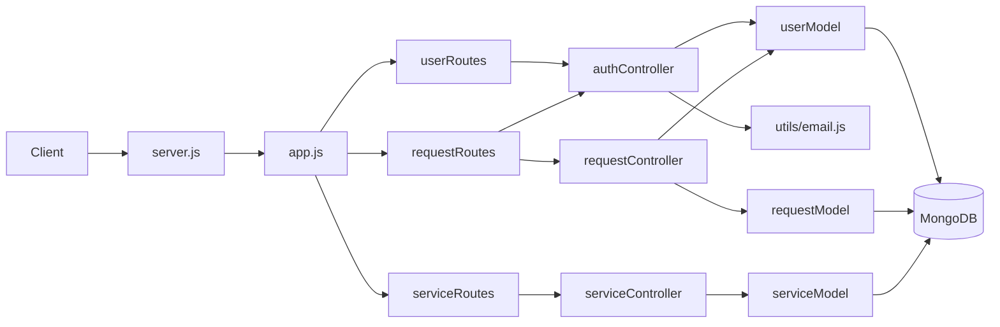

---

# 3. Technology Stack

## Packages Actually Used in Source Code

| Technology | What It Is | Why Used | How Used in San3a |
|------------|-----------|----------|-------------------|
| **Node.js** | JavaScript runtime | Run server-side JavaScript | Entry via `server.js`; `engines.node >= 16` in `package.json` |
| **Express** (`^5.2.1`) | Web framework | HTTP routing and middleware | `app.js` creates app; routes mounted at `/api/v1/*` |
| **MongoDB** | Document database | Store users, services, requests | Connected in `server.js` via Mongoose |
| **Mongoose** (`^9.6.3`) | MongoDB ODM | Schema definition, validation, queries | All models in `src/models/` |
| **dotenv** | Env loader | Load secrets from `.env` | `dotenv.config({ path: './.env' })` in `server.js` |
| **jsonwebtoken** | JWT library | Stateless authentication | `signToken()` and `jwt.verify()` in `authController.js` |
| **bcryptjs** | Password hashing | Secure password storage | `userModel.js` pre-save hook (12 rounds) and `correctPassword()` |
| **validator** | String validation | Email format validation | `validator.isEmail` on `User.email` |
| **crypto** (Node built-in) | Cryptographic utilities | Reset token generation/hashing | `createPasswordResetToken()` and `resetPassword()` |
| **cors** | CORS middleware | Allow frontend cross-origin requests | `app.js` with `FRONTEND_URL` origin |
| **nodemailer** | Email sending | Password reset emails | `src/utils/email.js` — **⚠️ used in code but NOT listed in `package.json` dependencies** |

## Packages in `package.json` But Not Used in Source

| Package | Status |
|---------|--------|
| **bcrypt** (`^6.0.0`) | Listed in dependencies; **`bcryptjs` is used instead** in `userModel.js` |
| **socket.io** | Was in `package-lock.json`; **removed from `package.json`** per `PERFORMANCE_GUIDE.md`; **not used in any source file** |

## Technologies Mentioned in Requirements But Not Implemented

| Technology | Status |
|------------|--------|
| **Joi** | Not implemented — no Joi schemas or dependency |
| **Multer** | Not implemented — no file upload handling |
| **Cloudinary** | Not implemented — `User.avatar` is a string defaulting to `'default.png'` with no upload logic |
| **Socket.IO** | Not implemented in current source (removed from active dependencies) |
| **Helmet** | Not implemented |
| **Rate limiting** | Not implemented |
| **cookie-parser** | Not implemented — `protect` checks `req.cookies.user_token` but cookies are never parsed |
| **Nodemailer** | Code exists but package not declared in `package.json` |

## Dev Dependencies

| Package | Purpose |
|---------|---------|
| **nodemon** | Auto-restart during development (`npm run dev`) |

---

# 4. Database Documentation

San3a uses **3 Mongoose collections**: `User`, `Service`, `Request`.

---

## 4.1 User Model

**File:** `src/models/userModel.js`  
**Collection:** `users`  
**Purpose:** Stores all platform users (customers, craftsmen, admins) with authentication fields and craftsman geolocation.

### Fields

| Field | Type | Required | Default | Validation / Notes |
|-------|------|----------|---------|-------------------|
| `name` | String | Yes | — | Arabic error message on missing |
| `email` | String | Yes | — | `unique`, `lowercase`, `validator.isEmail` |
| `phone` | String | Yes | — | `unique` |
| `password` | String | Yes | — | `minlength: 8`, `select: false` (excluded from queries by default) |
| `role` | String | No | `'customer'` | `enum: ['customer', 'craftsman', 'admin']` |
| `avatar` | String | No | `'default.png'` | No upload logic |
| `location.type` | String | No | `'Point'` | `enum: ['Point']` — GeoJSON Point type |
| `location.coordinates` | `[Number]` | No | `[31.2357, 30.0444]` | `[longitude, latitude]` — defaults to Cairo area |
| `location.address` | String | No | — | Optional text address |
| `isAvailable` | Boolean | No | `true` | Used for craftsman matching |
| `passwordChangedAt` | Date | No | — | Used by `changePasswordAfter()` for JWT invalidation |
| `isActive` | Boolean | No | `true` | `select: false`; checked in `protect` middleware |
| `passwordResetToken` | String | No | — | Stores **SHA-256 hash** of reset token |
| `passwordResetExpires` | Date | No | — | Token expiry (10 minutes from creation) |
| `createdAt` | Date | Auto | — | From `timestamps: true` |
| `updatedAt` | Date | Auto | — | From `timestamps: true` |

### Indexes

```javascript
userSchema.index({ location: '2dsphere' });
```

Enables `$near` geospatial queries on craftsman locations.

### References

- Referenced by `Request.client` and `Request.craftsman`.

### Middleware / Hooks

**`pre('save')`** — Password hashing:
- Runs only if `password` is modified.
- Hashes with `bcrypt.hash(this.password, 12)`.
- Note: `.env.example` defines `BCRYPT_ROUNDS=10` but code hardcodes **12**.

### Instance Methods

| Method | Purpose |
|--------|---------|
| `correctPassword(candidatePassword, userPassword)` | Compares plain password with bcrypt hash |
| `changePasswordAfter(JWTTimestamp)` | Returns `true` if JWT was issued before `passwordChangedAt` |
| `createPasswordResetToken()` | Generates random token, stores SHA-256 hash + 10 min expiry, returns plain token |

### Static Methods

**None defined.**

### Virtual Fields

**None defined.**

---

## 4.2 Service Model

**File:** `src/models/serviceModel.js`  
**Collection:** `services`  
**Purpose:** Catalog of home service types displayed on the landing page and linked to requests.

### Fields

| Field | Type | Required | Default | Validation |
|-------|------|----------|---------|------------|
| `nameAr` | String | Yes | — | `unique`, `trim` |
| `nameEn` | String | Yes | — | `unique`, `trim` |
| `slug` | String | Yes | — | `unique` |
| `icon` | String | Yes | — | Icon identifier/path |
| `isActive` | Boolean | No | `true` | Only active services returned by `getAllServices` |
| `createdAt` / `updatedAt` | Date | Auto | — | `timestamps: true` |

### Indexes

No explicit indexes beyond unique field indexes created by Mongoose for `nameAr`, `nameEn`, `slug`.

### References

- Referenced by `Request.service`.

### Hooks / Methods / Virtuals

**None.**

---

## 4.3 Request Model

**File:** `src/models/requestModel.js`  
**Collection:** `requests`  
**Purpose:** Represents a customer's service order from creation through completion.

### Fields

| Field | Type | Required | Default | Validation |
|-------|------|----------|---------|------------|
| `client` | ObjectId → User | Yes | — | Customer who created the request |
| `craftsman` | ObjectId → User | No | `null` | Assigned when craftsman accepts |
| `service` | ObjectId → Service | Yes | — | Service type |
| `status` | String | No | `'PENDING_MATCHING'` | `enum: ['PENDING_MATCHING', 'ACCEPTED', 'ARRIVED', 'IN_PROGRESS', 'COMPLETED', 'CANCELLED']` |
| `statusHistory` | Array of subdocs | No | — | `{ status, changeAt, note }` — see note below |
| `arriveAt` | Date | No | — | Not populated by current controllers |
| `startedAt` | Date | No | — | Not populated by current controllers |
| `completedAt` | Date | No | — | Not populated by current controllers |
| `location.address` | String | Yes | — | Text address |
| `location.coordinates` | `[Number]` | Yes | — | `[longitude, latitude]` — **not GeoJSON Point wrapper** |
| `scheduledAt` | Date | No | `Date.now` | Request scheduling time |
| `clientNotes` | String | No | — | Customer notes |
| `pricing.baseFee` | Number | Yes | `0` | Set to 120 in controller |
| `pricing.emergencyFee` | Number | No | `0` | Set to 30 for immediate requests |
| `pricing.totalAmount` | Number | Yes | `0` | Sum of fees |
| `paymentMethod` | String | No | `'CASH'` | `enum: ['CASH', 'CARD', 'VODAFONE_CASH']` |
| `isPaid` | Boolean | No | `false` | No payment processing logic |
| `createdAt` / `updatedAt` | Date | Auto | — | `timestamps: true` |

**Schema inconsistency:** `statusHistory` subdocument field is `changeAt` in the schema, but controllers push `changedAt` — the timestamp may not persist as intended.

### Indexes

```javascript
requestSchema.index({ "location.coordinates": "2dsphere" });
```

**Note:** This indexes a raw coordinate array, not a GeoJSON `Point`. The geospatial query in `findNearbyCraftsmen` queries **User.location** (proper GeoJSON), not Request location. This index may not function as intended for request-based queries.

### References

| Field | References |
|-------|------------|
| `client` | `User` |
| `craftsman` | `User` |
| `service` | `Service` |

### Hooks / Methods / Virtuals

**None defined.**

---

## Collection Relationships

```
User (customer)
 ├─ creates many → Request (as client)
 └─ may be assigned to many → Request (as craftsman)

User (craftsman)
 ├─ has one → location (GeoJSON Point)
 ├─ can be assigned to many → Request (as craftsman)
 └─ isAvailable toggled on accept/complete

Service
 └─ referenced by many → Request

Request
 ├─ belongs to one → User (client)
 ├─ optionally belongs to one → User (craftsman)
 └─ belongs to one → Service
```

---

# 5. Authentication & Authorization Flow

## Overview

San3a uses **JWT (JSON Web Token)** bearer authentication. Tokens are signed with `JWT_SECRET` and expire in **90 days**. There is **no refresh token strategy** and **no logout endpoint** (client-side token removal only).

## Signup Flow

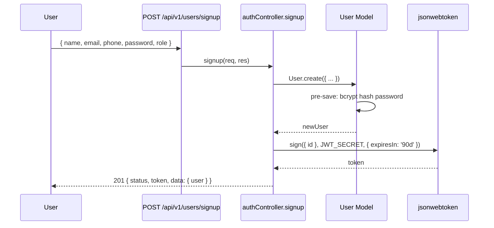

**Steps:**
1. Client sends `POST /api/v1/users/signup` with user fields.
2. `User.create()` validates schema and hashes password via pre-save hook.
3. `signToken(newUser._id)` generates JWT.
4. Password removed from response object.
5. Returns `201` with token and user data.

**No authentication required.** Any role can be passed in body (including `admin`) — **no server-side role restriction on signup**.

## Login Flow

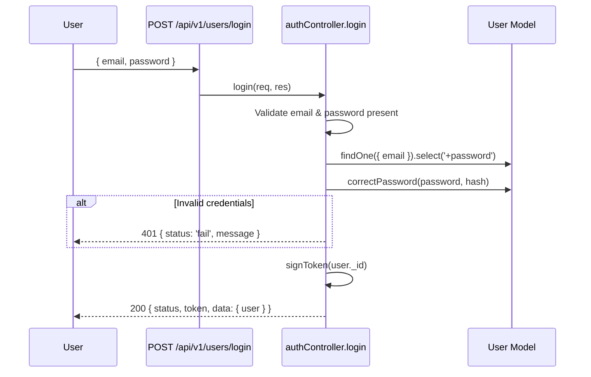

## Logout Flow

**Not implemented** on the backend. The frontend clears `localStorage` tokens client-side.

## JWT Generation

```javascript
// src/controllers/authController.js
const signToken = id => {
  return jwt.sign({ id }, process.env.JWT_SECRET, {
    expiresIn: '90d'
  });
};
```

Payload contains only `{ id: userId }`. No role embedded in token.

## JWT Verification (`protect`)

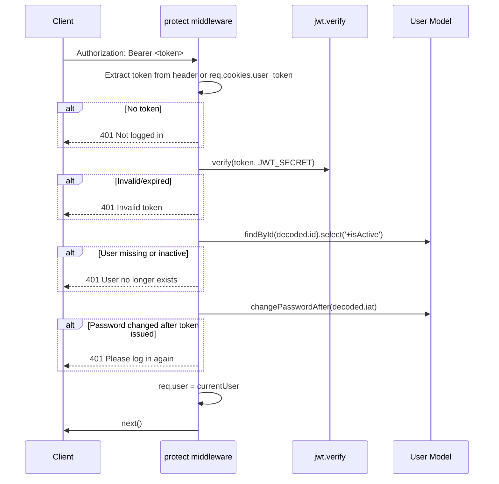

**Token sources (in order):**
1. `Authorization: Bearer <token>` header
2. `req.cookies.user_token` cookie — **requires cookie-parser (Not implemented)**

## `restrictTo` Middleware

Factory function returning middleware that checks `req.user.role` against allowed roles:

```javascript
exports.restrictTo = (...roles) => {
  return (req, res, next) => {
    if (!roles.includes(req.user.role)) {
      return res.status(403).json({ status: 'fail', message: "you don't have permission..." });
    }
    next();
  };
};
```

Must run **after** `protect`.

## Password Hashing

- Library: **bcryptjs**
- Rounds: **12** (hardcoded in `userModel.js`)
- Triggered on `pre('save')` when password is modified

## Password Comparison

`user.correctPassword(candidatePassword, userPassword)` uses `bcrypt.compare()`.

## `passwordChangedAt` Logic

`changePasswordAfter(JWTTimestamp)` compares JWT `iat` (issued-at, seconds) with `passwordChangedAt` (converted to seconds). Returns `true` if token was issued before password change.

**Note:** `resetPassword` does **not** set `passwordChangedAt` after password update — this logic is incomplete.

## Token Expiration

- JWT expires in **90 days**
- No refresh token or silent renewal

## Refresh Strategy

**Not implemented.**

## Security Considerations (Current State)

| Aspect | Status |
|--------|--------|
| Password hashing | ✅ Implemented |
| JWT secret from env | ✅ Required at runtime |
| Token in Authorization header | ✅ Supported |
| Cookie-based auth | ⚠️ Referenced but cookie-parser not installed |
| Role in JWT payload | ❌ Not included — role fetched from DB on each request via protect |
| Admin signup restriction | ❌ Not enforced |
| Rate limiting on auth endpoints | ❌ Not implemented |

---

# 6. Password Reset Flow

## Overview

Partially implemented in `authController.js` (`forgotPassword`, `resetPassword`) and `userModel.createPasswordResetToken()`.

## Forgot Password

**Endpoint:** `POST /api/v1/users/forgotPassword`

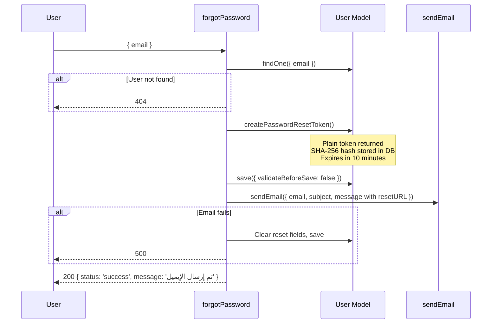

### Reset Token Generation

1. `crypto.randomBytes(32).toString('hex')` → **plain token** (sent to user)
2. `crypto.createHash('sha256').update(resetToken).digest('hex')` → **hashed token** (stored in DB)

### Why Crypto Is Used

- `randomBytes` provides cryptographically secure randomness for unpredictable tokens.
- SHA-256 hashing ensures that if the database is compromised, plain reset tokens are not exposed.

### Original vs Hashed Token

| Token | Where | Purpose |
|-------|-------|---------|
| Plain | Email link URL | User presents this to reset endpoint |
| Hashed (SHA-256) | `passwordResetToken` in DB | Compared on reset |

### Token Expiration

`passwordResetExpires = Date.now() + 10 * 60 * 1000` (10 minutes)

### Reset URL Format

```
{protocol}://{host}/api/v1/users/resetPassword/{plainToken}
```

Built dynamically from the incoming request host.

## Reset Password

**Endpoint:** `POST /api/v1/users/resetPassword/:token`

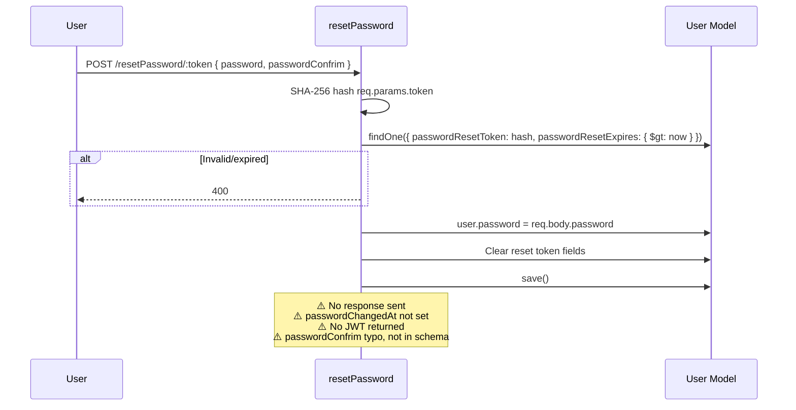

### Incomplete Implementation Notes

The `resetPassword` function ends after `user.save()` with comments indicating planned steps (update `passwordChangedAt`, log user in, send JWT) — **these are not implemented**. The handler does not send any HTTP response on success, which will cause the client to hang.

### Security Rationale

| Step | Why |
|------|-----|
| Hash token in DB | DB leak does not expose usable reset links |
| Short expiry (10 min) | Limits attack window |
| Clear tokens on email failure | Prevents orphaned valid tokens |
| Clear tokens after use | Prevents token reuse |

---

# 7. API Documentation

**Base URL:** `http://localhost:{PORT}/api/v1` (default port `5000`)

**Standard success response shape:**
```json
{
  "status": "success",
  "data": { ... },
  "token": "..." // auth endpoints only
}
```

**Standard error response shape:**
```json
{
  "status": "fail" | "error",
  "message": "...",
  "error": "..." // sometimes included
}
```

---

## Health Check

### GET `/`

| Property | Value |
|----------|-------|
| **Method** | GET |
| **Path** | `/` |
| **Purpose** | Simple server health check |
| **Authentication** | No |
| **Roles** | Any |

**Example Response (200):**
```
server is working ....
```
(Plain text, not JSON)

---

## User Routes — `/api/v1/users`

---

### Signup

| Property | Value |
|----------|-------|
| **Method** | POST |
| **Path** | `/api/v1/users/signup` |
| **Purpose** | Register a new user account |
| **Authentication** | No |
| **Roles** | Any (role passed in body) |

**Request Body:**

| Field | Type | Required |
|-------|------|----------|
| `name` | string | Yes |
| `email` | string | Yes |
| `phone` | string | Yes |
| `password` | string | Yes (min 8 chars) |
| `role` | string | No (`customer` \| `craftsman` \| `admin`) |

**Example Request:**
```json
{
  "name": "Ahmed Ali",
  "email": "ahmed@example.com",
  "phone": "01012345678",
  "password": "password123",
  "role": "customer"
}
```

**Example Response (201):**
```json
{
  "status": "success",
  "token": "eyJhbGciOiJIUzI1NiIsInR5cCI6IkpXVCJ9...",
  "data": {
    "user": {
      "_id": "...",
      "name": "Ahmed Ali",
      "email": "ahmed@example.com",
      "phone": "01012345678",
      "role": "customer",
      "avatar": "default.png",
      "location": { "type": "Point", "coordinates": [31.2357, 30.0444] },
      "isAvailable": true
    }
  }
}
```

**Success Status:** `201`

**Possible Errors:**

| Code | Condition |
|------|-----------|
| `400` | Duplicate email/phone, validation failure |

**Related:** `authController.signup`, `User` model

**Internal Flow:**
1. `User.create()` with body fields
2. Pre-save hook hashes password
3. JWT signed with user `_id`
4. Password stripped from response

---

### Login

| Property | Value |
|----------|-------|
| **Method** | POST |
| **Path** | `/api/v1/users/login` |
| **Purpose** | Authenticate and receive JWT |
| **Authentication** | No |

**Request Body:**

| Field | Type | Required |
|-------|------|----------|
| `email` | string | Yes |
| `password` | string | Yes |

**Example Response (200):**
```json
{
  "status": "success",
  "token": "eyJhbGci...",
  "data": { "user": { ... } }
}
```

**Possible Errors:**

| Code | Condition |
|------|-----------|
| `400` | Missing email or password |
| `401` | Invalid credentials |
| `500` | Server error |

**Related:** `authController.login`, `User.correctPassword`

---

### Forgot Password

| Property | Value |
|----------|-------|
| **Method** | POST |
| **Path** | `/api/v1/users/forgotPassword` |
| **Purpose** | Send password reset email |
| **Authentication** | No |

**Request Body:** `{ "email": "user@example.com" }`

**Example Response (200):**
```json
{
  "status": "success",
  "message": "تم إرسال الإيميل"
}
```

**Possible Errors:**

| Code | Condition |
|------|-----------|
| `404` | Email not found |
| `500` | Email send failure |

**Related:** `authController.forgotPassword`, `User.createPasswordResetToken`, `utils/email.js`

**Note:** Requires `nodemailer` (not in `package.json`) and email env vars.

---

### Reset Password

| Property | Value |
|----------|-------|
| **Method** | POST |
| **Path** | `/api/v1/users/resetPassword/:token` |
| **Purpose** | Set new password using reset token |
| **Authentication** | No (token in URL) |

**Params:** `token` — plain reset token from email

**Request Body:**

| Field | Type |
|-------|------|
| `password` | string |
| `passwordConfrim` | string (typo in code; not validated) |

**Possible Errors:**

| Code | Condition |
|------|-----------|
| `400` | Invalid or expired token |

**Related:** `authController.resetPassword`, `User` model

**⚠️ Incomplete:** No success response returned; `passwordChangedAt` not updated.

---

### Get Profile (Test Route)

| Property | Value |
|----------|-------|
| **Method** | GET |
| **Path** | `/api/v1/users/profile` |
| **Purpose** | Test protected route — returns authenticated user |
| **Authentication** | Yes |
| **Roles** | Any authenticated user |

**Headers:** `Authorization: Bearer <token>`

**Example Response (200):**
```json
{
  "status": "success",
  "message": "أهلاً بك في صفحتك الشخصية المحمية! 🔐",
  "data": { "user": { ... } }
}
```

**Related:** `authController.protect`

---

### Admin Dashboard (Test Route)

| Property | Value |
|----------|-------|
| **Method** | GET |
| **Path** | `/api/v1/users/admin-dashboard` |
| **Authentication** | Yes |
| **Roles** | `admin` only |

**Possible Errors:** `403` if not admin

---

### Craftsman Orders (Test Route)

| Property | Value |
|----------|-------|
| **Method** | GET |
| **Path** | `/api/v1/users/craftsman-orders` |
| **Authentication** | Yes |
| **Roles** | `craftsman`, `admin` |

Placeholder message only — **no actual order listing logic**.

---

## Service Routes — `/api/v1/services`

---

### Get All Services

| Property | Value |
|----------|-------|
| **Method** | GET |
| **Path** | `/api/v1/services/` |
| **Purpose** | List active services for landing page |
| **Authentication** | No |

**Example Response (200):**
```json
{
  "status": "success",
  "results": 4,
  "data": {
    "services": [
      {
        "_id": "...",
        "nameAr": "سباكة",
        "nameEn": "Plumbing",
        "slug": "plumbing",
        "icon": "wrench",
        "isActive": true
      }
    ]
  }
}
```

**Related:** `serviceController.getAllServices`, `Service` model

---

### Create Service

| Property | Value |
|----------|-------|
| **Method** | POST |
| **Path** | `/api/v1/services/` |
| **Purpose** | Add a new service (intended for seeding/admin) |
| **Authentication** | No |

**Request Body:** All `Service` schema fields (`nameAr`, `nameEn`, `slug`, `icon`, optional `isActive`)

**Example Response (201):**
```json
{
  "status": "success",
  "data": { "service": { ... } }
}
```

**Possible Errors:** `400` duplicate slug/name or missing fields

**⚠️ Security gap:** No authentication or admin restriction on service creation.

---

## Request Routes — `/api/v1/requests`

All routes below use `router.use(authController.protect)` — **authentication required**.

---

### Create Request

| Property | Value |
|----------|-------|
| **Method** | POST |
| **Path** | `/api/v1/requests/` |
| **Authentication** | Yes |
| **Roles** | Any authenticated user (typically `customer`) |

**Request Body:**

| Field | Type | Required | Notes |
|-------|------|----------|-------|
| `service` | ObjectId string | Yes | Service ID |
| `address` | string | Yes | Text address |
| `coordinates` | `[number, number]` | Yes | `[longitude, latitude]` |
| `clientNotes` | string | No | |
| `paymentMethod` | string | No | `CASH` \| `CARD` \| `VODAFONE_CASH` |
| `scheduledAt` | ISO date string | No | Immediate if absent or past |

**Example Request:**
```json
{
  "service": "6a2e843ede228e7fc4e46bdc",
  "address": "Dubai Marina, Building 4, Apt 402",
  "coordinates": [31.2358, 30.0445],
  "clientNotes": "Water leak under sink",
  "paymentMethod": "CASH"
}
```

**Example Response (201):**
```json
{
  "status": "success",
  "data": {
    "request": {
      "_id": "...",
      "client": "...",
      "craftsman": null,
      "status": "PENDING_MATCHING",
      "pricing": {
        "baseFee": 120,
        "emergencyFee": 30,
        "totalAmount": 150
      }
    }
  }
}
```

**Internal Flow:**
1. Extract body fields
2. Compute `baseFee=120`, `emergencyFee=30` if immediate, else `0`
3. `Request.create()` with `client: req.user._id`
4. Return created request

**Related:** `requestController.createRequest`, `Request` model

---

### Get Request by ID

| Property | Value |
|----------|-------|
| **Method** | GET |
| **Path** | `/api/v1/requests/:id` |
| **Authentication** | Yes |

**Params:** `id` — Request MongoDB ObjectId

**Example Response (200):**
```json
{
  "status": "success",
  "data": { "request": { ... } }
}
```

**Possible Errors:** `404` not found, `400` invalid ID

**⚠️ No authorization check** — any authenticated user can fetch any request by ID.

---

### Find Nearby Craftsmen

| Property | Value |
|----------|-------|
| **Method** | GET |
| **Path** | `/api/v1/requests/:requestId/nearby-craftsmen` |
| **Authentication** | Yes |

**Params:** `requestId` — Request ID (used to read location coordinates)

**Example Response (200):**
```json
{
  "status": "success",
  "results": 3,
  "data": {
    "craftsmen": [
      {
        "_id": "...",
        "name": "Mohamed",
        "phone": "010...",
        "avatar": "default.png",
        "location": { "type": "Point", "coordinates": [31.24, 30.04] },
        "isAvailable": true
      }
    ]
  }
}
```

**Internal Flow:**
1. Load request by `requestId`
2. Extract `[longitude, latitude]` from `request.location.coordinates`
3. Query `User` with `$near`, `role: 'craftsman'`, `isAvailable: true`, `$maxDistance: 10000` (10 km)
4. Return matching craftsmen (limited fields)

**Related:** `requestController.findNearbyCraftsmen`, `User` geospatial index

---

### Update Request Status

| Property | Value |
|----------|-------|
| **Method** | PATCH |
| **Path** | `/api/v1/requests/:requestId/status` |
| **Authentication** | Yes |
| **Roles** | Intended for assigned craftsman (enforced in controller) |

**Request Body:** `{ "status": "IN_PROGRESS" }`

**Valid status values:** Any string accepted — **no enum validation at controller level** (only schema enum on save)

**Internal Flow:**
1. Load request
2. Verify `currentRequest.craftsman === req.user._id`
3. Update status and push to `statusHistory`
4. Save and return

**Possible Errors:** `404`, `403`

---

### Complete Request

| Property | Value |
|----------|-------|
| **Method** | PATCH |
| **Path** | `/api/v1/requests/:requestId/complete` |
| **Authentication** | Yes |
| **Roles** | Assigned craftsman only |

**Internal Flow:**
1. Verify craftsman ownership
2. Set status to `COMPLETED`
3. Push status history
4. Set craftsman `isAvailable: true`
5. Return updated request

---

### Accept Request — **Not exposed via routes**

`requestController.acceptRequest` exists in code but is **NOT registered** in `requestRoutes.js`. There is currently **no HTTP endpoint** to accept a request.

---

## 404 Handler

| Property | Value |
|----------|-------|
| **Method** | Any |
| **Path** | Any unmatched route |
| **Response (404)** | `{ "status": "fail", "message": "can't find {url} on this server !" }` |

---

# 8. Request Lifecycle

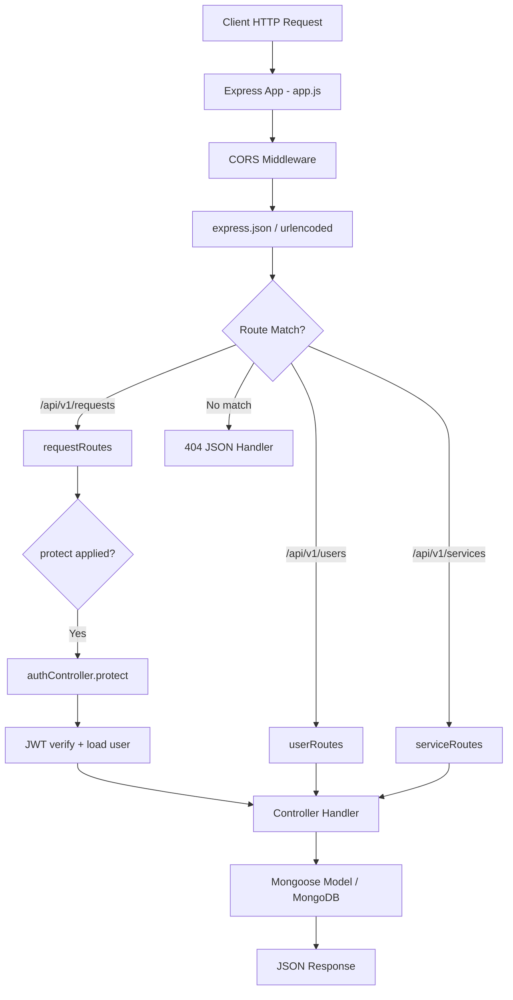

## Stage-by-Stage (Actual Implementation)

| Stage | File | Details |
|-------|------|---------|
| **1. Server bootstrap** | `server.js` | Load `.env`, connect MongoDB with pool options, call `app.listen()` |
| **2. Express app** | `app.js` | Create Express instance |
| **3. CORS** | `app.js` | Restrict origin to `FRONTEND_URL`, allow credentials |
| **4. Body parsing** | `app.js` | JSON and URL-encoded, 10 MB limit |
| **5. Routing** | `src/routes/*` | Mount routers at `/api/v1/users`, `/services`, `/requests` |
| **6. Authentication** | `requestRoutes.js` | `router.use(protect)` for all request routes; per-route on user routes |
| **7. Authorization** | `userRoutes.js` | `restrictTo('admin')` etc. on specific routes |
| **8. Controller** | `src/controllers/*` | Business logic, try/catch, direct model calls |
| **9. Database** | Mongoose models | CRUD, geospatial queries |
| **10. Response** | Controller | `res.status().json()` |
| **11. 404** | `app.js` | Catch-all for unknown routes |

**Not present:** validation middleware layer, service layer, global error handler, async wrapper utility.

---

# 9. Business Flows

## 9.1 Customer Registration Flow

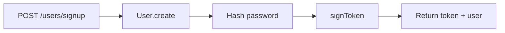

**Routes:** `POST /api/v1/users/signup`  
**Controller:** `authController.signup`  
**DB:** New document in `users` collection  
**Validations:** Mongoose schema (email, phone uniqueness, password min length)  
**Edge cases:** Duplicate email/phone → 400; any role including admin can be set in body

---

## 9.2 Customer Creates Request Flow

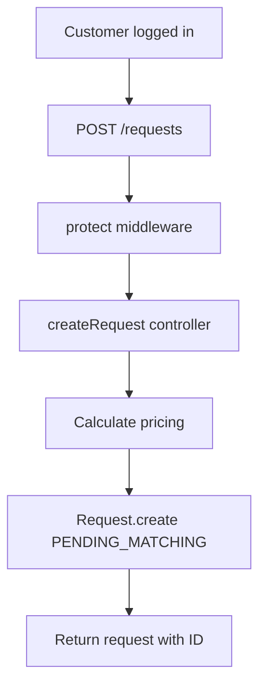

**Routes:** `POST /api/v1/requests/`  
**Controller:** `requestController.createRequest`  
**DB updates:** New `requests` document with `client: req.user._id`, `craftsman: null`  
**Pricing logic:**
- `baseFee = 120` always
- `emergencyFee = 30` if no `scheduledAt` or scheduled time ≤ now
- `totalAmount = baseFee + emergencyFee`

**Edge cases:** Invalid `service` ObjectId → 400; missing address/coordinates → 400

---

## 9.3 Craftsman Discovery / Nearby Craftsmen Flow

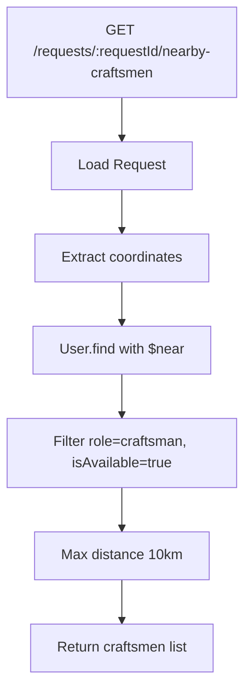

**Routes:** `GET /api/v1/requests/:requestId/nearby-craftsmen`  
**Controller:** `requestController.findNearbyCraftsmen`  
**Edge cases:** Request not found → 404; no craftsmen in range → empty array with `results: 0`

---

## 9.4 Craftsman Accepts Request Flow

**Controller implemented:** `requestController.acceptRequest`  
**Route:** **Not implemented** — no endpoint registered

**Intended flow (from controller code):**
1. Verify `req.user.role === 'craftsman'`
2. Load request; must be `PENDING_MATCHING`
3. Set `craftsman = req.user._id`, `status = ACCEPTED`
4. Push status history
5. Set craftsman `isAvailable = false`

**Edge cases handled in code:** Wrong role → 403; already accepted → 400; not found → 404

---

## 9.5 Request Status Update Flow

**Route:** `PATCH /api/v1/requests/:requestId/status`  
**Controller:** `requestController.updateRequestStatus`

1. Load request
2. Verify assigned craftsman matches `req.user`
3. Set new status from body
4. Append to `statusHistory`
5. Save

**Edge cases:** Not assigned craftsman → 403; no status transition validation (can jump to any status)

---

## 9.6 Request Completion Flow

**Route:** `PATCH /api/v1/requests/:requestId/complete`  
**Controller:** `requestController.completeRequest`

1. Verify craftsman ownership
2. Set `status = COMPLETED`
3. Push history
4. Set user `isAvailable = true`

**Note:** `completedAt`, `isPaid` not updated by controller.

---

## 9.7 Review and Rating Flow

**Not implemented.** No Review model or routes exist.

---

## 9.8 Notification Flow

**Not implemented.** No notification model, push, or email alerts for request events (except password reset email).

---

## 9.9 Payment Flow

**Partially implemented (data only):**
- `paymentMethod` enum stored on request
- `isPaid` boolean defaults to `false`
- **No payment gateway, webhook, or mark-as-paid endpoint**

---

# 10. Geolocation Logic

## How Coordinates Are Stored

### User (Craftsman) — Proper GeoJSON

```javascript
location: {
  type: { type: String, default: 'Point', enum: ['Point'] },
  coordinates: { type: [Number], default: [31.2357, 30.0444] }, // [lng, lat]
  address: String
}
```

### Request — Plain Coordinate Array

```javascript
location: {
  address: String,
  coordinates: [Number] // [longitude, latitude] — NOT wrapped in GeoJSON Point
}
```

## GeoJSON Structure (User Model)

MongoDB expects GeoJSON format for `2dsphere` indexes:

```json
{
  "type": "Point",
  "coordinates": [31.2357, 30.0444]
}
```

Stored as nested Mongoose subdocument matching GeoJSON Point spec.

## 2dsphere Indexes

| Collection | Index | File |
|------------|-------|------|
| `users` | `{ location: '2dsphere' }` | `userModel.js` |
| `requests` | `{ "location.coordinates": "2dsphere" }` | `requestModel.js` |

The **User index** powers the live nearby search. The **Request index** may be invalid because `location.coordinates` alone is not valid GeoJSON for `$geoNear` on that path.

## Nearby Search Query (Actual Code)

From `requestController.findNearbyCraftsmen`:

```javascript
const craftsmen = await User.find({
  role: 'craftsman',
  isAvailable: true,
  location: {
    $near: {
      $geometry: {
        type: 'Point',
        coordinates: [longitude, latitude], // from request.location.coordinates
      },
      $maxDistance: 10000, // meters = 10 km
    },
  },
}).select('name phone avatar location isAvailable');
```

## Distance Calculations

MongoDB `$near` with `$maxDistance` uses spherical geometry on the 2dsphere index. Results are sorted by distance ascending. **No explicit distance value is returned** in the response.

## Complete Nearby Craftsman Matching Process

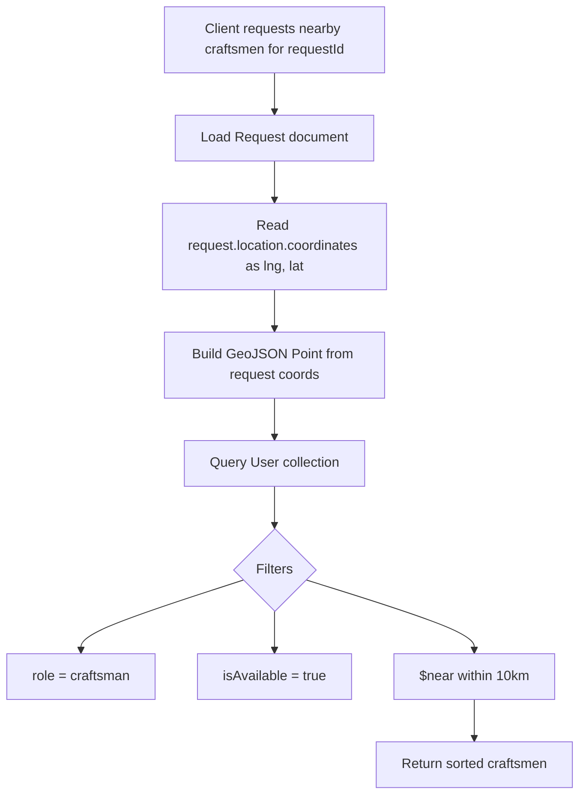

**Important:** Matching uses **craftsman's stored `User.location`**, not real-time GPS updates. Craftsmen must have accurate `location.coordinates` set (defaults to Cairo if never updated).

---

# 11. Middleware Documentation

San3a does not use a dedicated `middleware/` folder. Middleware functions live in `authController.js` or inline in route files.

## Global Middleware (app.js)

| Middleware | Purpose | Input | Output | Errors | Security |
|------------|---------|-------|--------|--------|----------|
| `cors(corsOptions)` | Cross-origin access control | HTTP request origin | CORS headers | None thrown | Restricts to `FRONTEND_URL` |
| `express.json({ limit: '10mb' })` | Parse JSON bodies | Request body | `req.body` | Express default 413 | Limits payload size |
| `express.urlencoded({ limit: '10mb', extended: true })` | Parse form bodies | URL-encoded body | `req.body` | Express default | Same |
| 404 handler | Unknown routes | Any unmatched path | 404 JSON | Always 404 | Information disclosure of URL |

**Execution order:** CORS → JSON → URL-encoded → Routes → 404

## `protect` (authController.js)

| Property | Value |
|----------|-------|
| **Purpose** | Verify JWT and attach user to `req.user` |
| **Input** | `Authorization: Bearer <token>` or `req.cookies.user_token` |
| **Output** | Sets `req.user`, calls `next()` |
| **Errors** | 401 JSON for missing/invalid/expired token, inactive user, password changed |
| **Security** | Core auth gate; logs token to console (`console.log("Token detected:", token)`) — **information leak in production** |

## `restrictTo(...roles)` (authController.js)

| Property | Value |
|----------|-------|
| **Purpose** | Role-based access control |
| **Input** | `req.user.role` (must run after `protect`) |
| **Output** | `next()` if role allowed |
| **Errors** | 403 if role not in allowed list |

## Route-Level Middleware Application

| Router | Middleware |
|--------|------------|
| `requestRoutes.js` | `router.use(protect)` — all request routes |
| `userRoutes.js` | `protect` + `restrictTo` on specific GET routes |
| `serviceRoutes.js` | None |

## Not Implemented

- Global error handler middleware
- `catchAsync` wrapper
- Request validation middleware (Joi/express-validator)
- Upload middleware (Multer)
- Rate limiting
- Helmet security headers
- Cookie parser

---

# 12. Utility Functions

## `sendEmail(options)` — `src/utils/email.js`

| Property | Value |
|----------|-------|
| **Purpose** | Send plain-text emails via SMTP (password reset) |
| **Used by** | `authController.forgotPassword` |
| **Input** | `{ email, subject, message }` |
| **Output** | Promise (resolves on send, throws on failure) |
| **Dependencies** | `nodemailer`, env vars: `EMAIL_HOST`, `EMAIL_PORT`, `EMAIL_USERNAME`, `EMAIL_PASSWORD` |

**Example usage:**
```javascript
await sendEmail({
  email: user.email,
  subject: 'Reset Password',
  message: `Click here: ${resetURL}`
});
```

**Note:** `from` address is hardcoded as `'Mohamed Madyan <Mohamedmadyan@io.com>'`.

## `signToken(id)` — `src/controllers/authController.js`

| Property | Value |
|----------|-------|
| **Purpose** | Generate JWT for authenticated user |
| **Used by** | `signup`, `login` |
| **Input** | User MongoDB `_id` |
| **Output** | JWT string (90-day expiry) |

## User Model Instance Methods

Documented in [Section 4.1](#41-user-model): `correctPassword`, `changePasswordAfter`, `createPasswordResetToken`.

**No other utility/helper files exist.**

---

# 13. Error Handling Strategy

## Current Approach

Errors are handled **locally inside each controller** using `try/catch` blocks. There is **no centralized error handling**.

## Operational vs Programming Errors

| Type | Handling |
|------|----------|
| **Operational** (expected failures) | Returned as JSON with appropriate status codes (400, 401, 403, 404) |
| **Programming** (unexpected bugs) | Some caught as 500 with `err.message`; uncaught errors may crash the process |

## Global Error Handler

**Not implemented.** No Express error-handling middleware (`app.use((err, req, res, next) => ...)`).

## AppError

**Not implemented.** No custom error class.

## Async Error Handling

Controllers use manual `try/catch`. **`catchAsync` wrapper not implemented.**  
Note: `promisify` is imported in `authController.js` but **never used**.

## Environment Differences

- `NODE_ENV` is defined in `.env.example` but **not used** in backend code for error formatting or logging differentiation.
- `npm run start:prod` sets `NODE_ENV=production` but app behavior is identical.

## Response Format

**Success:**
```json
{ "status": "success", "data": { ... } }
```

**Failure:**
```json
{ "status": "fail", "message": "...", "error": "..." }
```

Inconsistent: some endpoints (e.g. `forgotPassword` 404) omit `status` field.

---

# 14. Security Documentation

## Implemented Practices

| Practice | Implementation | Location |
|----------|----------------|----------|
| Password hashing | bcryptjs, 12 rounds | `userModel.js` pre-save |
| JWT authentication | Bearer token | `authController.protect` |
| Environment variables | Secrets in `.env` | `server.js`, `authController.js` |
| JWT expiration | 90 days | `signToken()` |
| Secure password reset | Hashed token in DB, 10 min expiry | `createPasswordResetToken()` |
| Email validation | `validator.isEmail` | `userModel.js` |
| Password excluded from queries | `select: false` | `userModel.js` |
| CORS restriction | Single origin | `app.js` |
| MongoDB injection | Mongoose parameterized queries | All model operations |
| Inactive user blocking | `isActive` check | `protect` middleware |

## Not Implemented / Gaps

| Item | Risk | Recommendation |
|------|------|----------------|
| **Helmet** | Missing security headers | Add `helmet()` |
| **Rate limiting** | Brute-force on login/forgot password | Add `express-rate-limit` |
| **cookie-parser** | Cookie auth path broken | Install or remove cookie check |
| **Admin role on signup** | Privilege escalation | Restrict admin role creation |
| **Unprotected service POST** | Anyone can add services | Add `protect` + `restrictTo('admin')` |
| **Request GET authorization** | IDOR — any user reads any request | Verify client/craftsman ownership |
| **JWT in console.log** | Token leakage in logs | Remove debug log in `protect` |
| **No HTTPS enforcement** | Token interception | Enforce HTTPS in production |
| **90-day JWT expiry** | Long-lived stolen tokens | Shorten expiry + refresh tokens |
| **nodemailer not in package.json** | Runtime crash on forgot password | Add dependency |
| **resetPassword incomplete** | Hung requests, no passwordChangedAt | Complete handler |
| **XSS protection** | API returns JSON only — low server-side XSS risk | Frontend must sanitize; no CSP headers |
| **Input validation library** | Incomplete body validation | Add Joi/express-validator |
| **BCRYPT_ROUNDS env ignored** | Config drift | Use `process.env.BCRYPT_ROUNDS` |

---

# 15. Environment Variables

## Required Variables

| Variable | Purpose | Example | Mandatory | Security |
|----------|---------|---------|-----------|----------|
| `MONGO_URI` | MongoDB connection string | `mongodb://localhost:27017/san3a` | Yes (defaults in code if missing) | Contains credentials in production — use secrets manager |
| `JWT_SECRET` | JWT signing key | `super_secret_random_string_min_32_chars` | **Yes** — app fails at token ops without it | Must be long, random, never committed |
| `PORT` | HTTP server port | `5000` | No (default 5000) | — |
| `NODE_ENV` | Environment name | `development` / `production` | No | Not used in app logic currently |
| `FRONTEND_URL` | CORS allowed origin | `http://localhost:3000` | No (default localhost:3000) | Set to exact production frontend URL |

## Email Variables (for forgot password)

| Variable | Purpose | Example | Mandatory | Security |
|----------|---------|---------|-----------|----------|
| `EMAIL_HOST` | SMTP host | `smtp.mailtrap.io` | Yes for email features | — |
| `EMAIL_PORT` | SMTP port | `587` | Yes for email features | — |
| `EMAIL_USERNAME` | SMTP user | `your_username` | Yes for email features | Secret |
| `EMAIL_PASSWORD` | SMTP password | `your_password` | Yes for email features | Secret |

## Defined but Unused

| Variable | Notes |
|----------|-------|
| `BCRYPT_ROUNDS` | In `.env.example` but code hardcodes 12 |

## Example `.env.example`

```env
# MongoDB Connection
MONGO_URI=mongodb://localhost:27017/san3a

# Server Configuration
PORT=5000
NODE_ENV=development

# Frontend URL (for CORS)
FRONTEND_URL=http://localhost:3000

# JWT Secret (use a long random string in production)
JWT_SECRET=your_jwt_secret_key_here

# Bcrypt Salt Rounds (defined but not used by code — rounds hardcoded to 12)
BCRYPT_ROUNDS=10

# Email Configuration (required for forgot password)
EMAIL_HOST=smtp.mailtrap.io
EMAIL_PORT=587
EMAIL_USERNAME=your_smtp_username
EMAIL_PASSWORD=your_smtp_password
```

---

# 16. Deployment Documentation

## Prerequisites

- Node.js >= 16 (`package.json` engines)
- MongoDB instance (local or Atlas)
- npm

## Installation

```bash
cd backend
npm install
cp .env.example .env
# Edit .env with your values
```

## npm Scripts

| Script | Command | Purpose |
|--------|---------|---------|
| `npm start` | `node server.js` | Production start |
| `npm run dev` | `nodemon server.js` | Development with auto-reload |
| `npm run start:prod` | `NODE_ENV=production node server.js` | Production with env flag |
| `npm test` | Placeholder | **Not implemented** — exits with error |

## Development Mode

```bash
cd backend
npm run dev
```

Expected output:
```
✅ Database connected successfully!
🚀 Server is running and listening on port 5000...
```

## Production Mode

```bash
cd backend
npm run start:prod
```

## Database Setup

1. Start MongoDB locally or provision MongoDB Atlas.
2. Set `MONGO_URI` in `.env`.
3. The database and collections are created automatically on first write.

## Seed Data

**Not implemented.** No seed script exists.

To populate services manually:
```bash
curl -X POST http://localhost:5000/api/v1/services/ \
  -H "Content-Type: application/json" \
  -d '{
    "nameAr": "سباكة",
    "nameEn": "Plumbing",
    "slug": "plumbing",
    "icon": "wrench"
  }'
```

## Build

**Not applicable** — plain Node.js, no build step.

## Start

```bash
npm start
```

API available at `http://localhost:5000/api/v1/`.

---

# 17. API Flow Diagrams

## Authentication

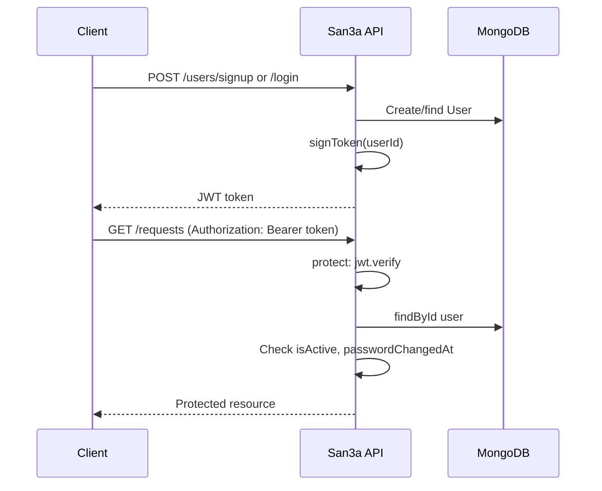

## Password Reset

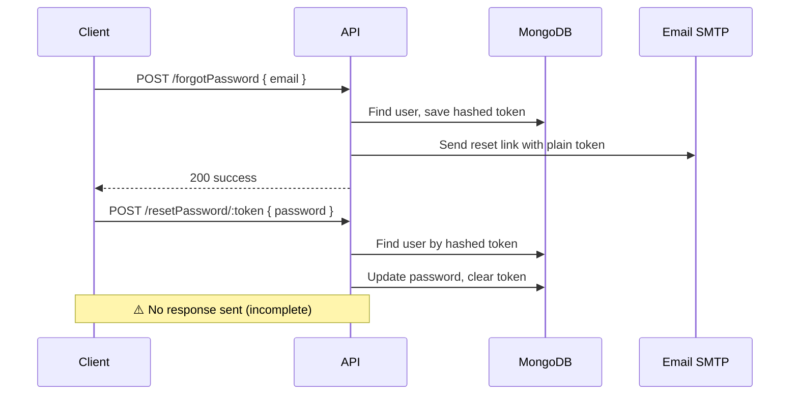

## Request Lifecycle

See [Section 8](#8-request-lifecycle).

## Customer Request Flow

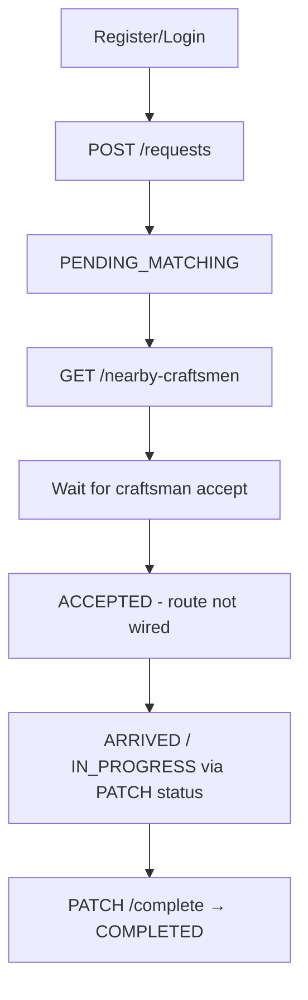

## Craftsman Matching Flow

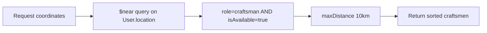

## Request Completion Flow

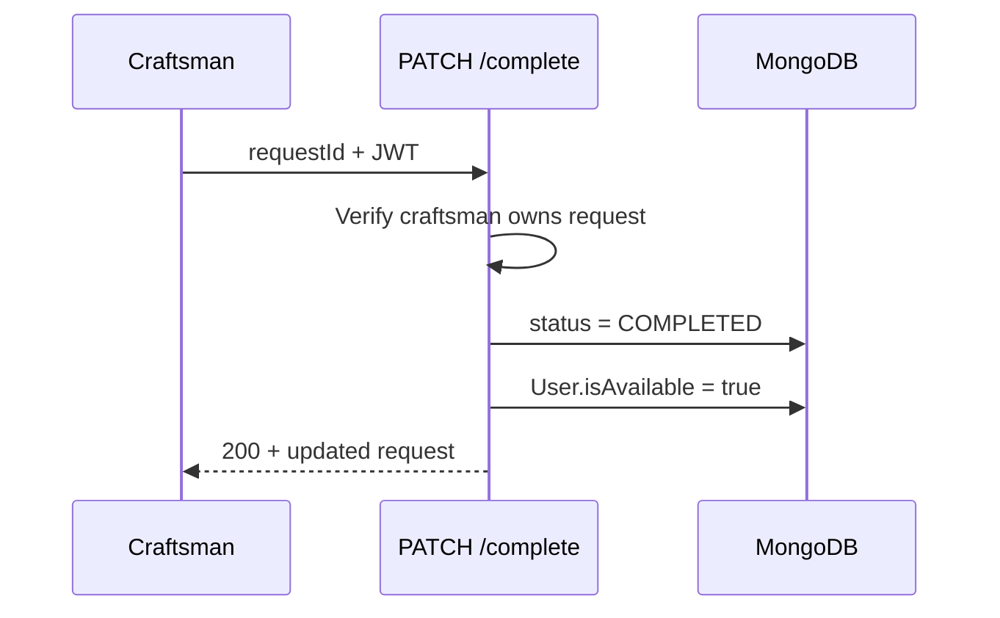

---

# 18. Project Assessment

## Strengths

1. **Clear MVC structure** — easy for new developers to navigate routes → controllers → models.
2. **Solid auth foundation** — JWT, bcrypt hashing, password reset token hashing pattern, `passwordChangedAt` check in protect.
3. **Geospatial matching** — proper GeoJSON on User model with `$near` query for craftsman discovery.
4. **Request lifecycle modeling** — status enum, status history, pricing breakdown, payment method placeholder.
5. **MongoDB connection hardening** — pool size, timeouts, reconnect handlers in `server.js`.
6. **CORS configured** — origin restricted to frontend URL.

## Weaknesses

1. **Incomplete features** — `acceptRequest` not routed; `resetPassword` incomplete; no response on successful reset.
2. **Missing dependencies** — `nodemailer` used but not in `package.json`; `bcrypt` listed but `bcryptjs` used.
3. **No service layer or global error handler** — business logic and error handling duplicated across controllers.
4. **Schema inconsistencies** — `statusHistory.changeAt` vs controller's `changedAt`; Request geo index on non-GeoJSON field.
5. **No tests** — `npm test` is a placeholder.
6. **Debug logging** — JWT printed to console in `protect`.

## Scalability Concerns

- Single Node process, no clustering or load balancer guidance.
- No caching for service catalog reads.
- Geospatial queries on growing user base need compound indexes (`role`, `isAvailable`, `location`).
- No pagination on any list endpoint.
- Synchronous email sending blocks forgot-password request.

## Maintainability Concerns

- Auth middleware mixed into controller file.
- Hardcoded pricing (`120`, `30`) in controller instead of config/service.
- Arabic and English error messages mixed without i18n structure.
- Unused imports (`promisify` in authController).

## Performance Concerns

- `findNearbyCraftsmen` loads full request before query — acceptable for MVP.
- No database query projection on request populate (no populate used at all).
- 10 MB body limit may be excessive for JSON-only API.

## Security Concerns

See [Section 14](#14-security-documentation). Highest priority: complete reset password flow, add nodemailer dependency, restrict admin signup, protect service creation, fix IDOR on get request, remove token logging.

## Suggested Refactoring

1. Extract `protect`, `restrictTo`, `signToken` to `src/middleware/authMiddleware.js`.
2. Create `src/utils/catchAsync.js` and `src/utils/AppError.js`.
3. Add global error handler in `app.js`.
4. Wire `acceptRequest` route: `PATCH /:requestId/accept`.
5. Complete `resetPassword` with `passwordChangedAt`, JWT response.
6. Add `src/config/` for pricing constants and JWT options.

## Suggested Folder Improvements

```
src/
├── config/
│   ├── db.js
│   └── constants.js
├── middleware/
│   ├── authMiddleware.js
│   └── errorMiddleware.js
├── services/
│   ├── authService.js
│   ├── requestService.js
│   └── emailService.js
└── validators/
    ├── authValidator.js
    └── requestValidator.js
```

## Suggested Database Improvements

1. Add compound index: `{ role: 1, isAvailable: 1, location: '2dsphere' }` on users.
2. Fix Request location to GeoJSON Point or remove invalid 2dsphere index.
3. Align `statusHistory` field names.
4. Add `passwordConfirm` validation at schema level for signup/reset.
5. Add Review collection when implementing ratings.

## Production Readiness Checklist

| Item | Status |
|------|--------|
| Environment validation on startup | ❌ |
| Health check endpoint (JSON) | ❌ (only plain text `/`) |
| Logging (Winston/Pino) | ❌ |
| Process manager (PM2) docs | ❌ |
| HTTPS / reverse proxy | ❌ |
| Database migrations/seeds | ❌ |
| API versioning | ✅ `/api/v1` |
| Automated tests | ❌ |
| CI/CD | ❌ |
| Monitoring | ❌ |

---

*End of San3a Backend Technical Documentation*
