# San3a Backend — Complete Technical Documentation

> **Generated from source code analysis** of the `backend/` directory.  
> All statements reflect the actual implementation. Features not present in code are marked **Not implemented**.

---

## Table of Contents

1. [Project Overview](#1-project-overview)
2. [System Architecture](#2-system-architecture)
3. [Technology Stack](#3-technology-stack)
4. [Database Documentation](#4-database-documentation)
5. [Authentication & Authorization Flow](#5-authentication--authorization-flow)
6. [Password Reset Flow](#6-password-reset-flow)
7. [API Documentation](#7-api-documentation)
8. [Request Lifecycle](#8-request-lifecycle)
9. [Business Flows](#9-business-flows)
10. [Geolocation Logic](#10-geolocation-logic)
11. [Middleware Documentation](#11-middleware-documentation)
12. [Utility Functions](#12-utility-functions)
13. [Error Handling Strategy](#13-error-handling-strategy)
14. [Security Documentation](#14-security-documentation)
15. [Environment Variables](#15-environment-variables)
16. [Deployment Documentation](#16-deployment-documentation)
17. [API Flow Diagrams](#17-api-flow-diagrams)
18. [Project Assessment](#18-project-assessment)

---

# 1. Project Overview

## What is San3a?

**San3a** (Arabic: **صنعة**) is a Node.js REST API for a home-services marketplace. It connects **customers** (homeowners) with **craftsmen** (service professionals) for jobs such as:

- Cleaning (نظافة)
- Air conditioning (تكييف)
- Plumbing (سباكة)
- Electrical work (كهرباء)

The platform handles user registration, JWT authentication, service catalog management, geospatial craftsman discovery, **weighted match scoring**, request lifecycle management, and craftsman response-time tracking.

## Problem It Solves

Finding a **nearby, available, reliable craftsman** quickly — especially for urgent home repairs — is difficult through informal channels. San3a centralizes this by:

1. Letting customers submit structured service requests with location and notes.
2. Finding nearby available craftsmen using MongoDB geospatial queries.
3. Ranking craftsmen with a **multi-factor match score** (distance, rating, response speed, prior history).
4. Tracking craftsman accept/reject responses to improve future matching.
5. Managing the full request lifecycle from matching through completion.

## Main Idea

San3a is a **smart matching platform** between customers and craftsmen:

```
Customer creates Request (PENDING_MATCHING)
        ↓
System finds nearby craftsmen + computes match scores
        ↓
Craftsmen see offers (tracked in matchingPool)
        ↓
Craftsman accepts (ACCEPTED) or rejects (response time recorded)
        ↓
Craftsman progresses status → COMPLETED
        ↓
Craftsman becomes available again
```

## User Roles and Responsibilities

| Role | Enum | Responsibilities (from code) |
|------|------|------------------------------|
| **Customer** | `customer` | Register/login; create service requests; view requests; trigger nearby search and match results. Default role on signup. |
| **Craftsman** | `craftsman` | Register with craftsman role; accept or reject offered requests; update request status; complete requests; has `location`, `isAvailable`, `rating`, and `avgResponseTimeSeconds` used in matching. |
| **Admin** | `admin` | Access placeholder route `/admin-dashboard` via `restrictTo('admin')`. No admin management APIs beyond this test route. |

## Overall Business Logic

1. **Services** are catalog entries (`Service` model) seeded via `seed.js` or created via API.
2. **Requests** link `client` (User), optional `craftsman` (User), and `service` (Service).
3. New requests start as `PENDING_MATCHING` with `craftsman: null`.
4. **Pricing** is computed in `createRequest`: `baseFee = 120`, `emergencyFee = 30` for immediate requests, `totalAmount = baseFee + emergencyFee`.
5. **Nearby search** (`findNearbyCraftsmen`) uses `$geoNear` aggregation, default radius **5 km** (override via `?radius=` in meters). Results are added to `matchingPool`.
6. **Match scoring** (`getMatchResults`) ranks craftsmen using weighted formula: 40% distance, 30% rating, 20% response time, 10% prior history with same client.
7. **Accept/reject** updates `matchingPool` entries and calls `User.recordResponseTime()` to maintain a running average.
8. On accept, craftsman is assigned and `isAvailable = false`. On complete, `isAvailable = true`.

**Not implemented:** Review submission API (rating field exists on User but no endpoint updates it), notifications, payment gateway, real-time WebSocket updates, logout endpoint, refresh tokens.

---

# 2. System Architecture

## Backend Architecture

```
server.js          → Entry: dotenv, MongoDB connection, HTTP listen
app.js             → Express setup, CORS, body parsing, route mounting
seed.js            → Standalone script to seed Service catalog
Dockerfile         → Multi-stage production container image
docker-compose.yml → Local MongoDB + backend orchestration
src/
  routes/          → HTTP route definitions
  controllers/     → Request handlers (business logic inline)
  models/          → Mongoose schemas, hooks, instance methods
  utils/           → Email sender utility
```

There is **no separate service layer**, **no middleware folder**, and **no config module**. Auth middleware lives in `authController.js`.

## Folder Structure

```
backend/
├── server.js
├── app.js
├── seed.js
├── Dockerfile
├── docker-compose.yml
├── .dockerignore
├── package.json
├── .env.example
├── SAN3A_BACKEND_DOCUMENTATION.md
├── README.md
└── src/
    ├── controllers/
    │   ├── authController.js
    │   ├── requestController.js
    │   └── serviceController.js
    ├── models/
    │   ├── userModel.js
    │   ├── requestModel.js
    │   └── serviceModel.js
    ├── routes/
    │   ├── userRoutes.js
    │   ├── requestRoutes.js
    │   └── serviceRoutes.js
    └── utils/
        └── email.js
```

### Folder Purposes

| Folder | Exists? | Purpose |
|--------|---------|---------|
| `controllers/` | ✅ | HTTP handlers; business logic, geospatial aggregation, match scoring |
| `models/` | ✅ | Mongoose schemas, validations, indexes, hooks, instance methods |
| `routes/` | ✅ | URL → controller mapping and middleware application |
| `utils/` | ✅ | `sendEmail()` via Nodemailer |
| `middleware/` | ❌ Not implemented | `protect` / `restrictTo` in `authController.js` |
| `services/` | ❌ Not implemented | Logic inline in controllers |
| `config/` | ❌ Not implemented | Env vars read directly via `process.env` |
| `validators/` | ❌ Not implemented | Mongoose schema + manual controller checks |
| `helpers/` | ❌ Not implemented | Helper functions inline (e.g. `normalize()` in `requestController.js`) |

## Why This Architecture Was Chosen

Minimal **Express + Mongoose MVC** suitable for an MVP/graduation project: fast development, easy tracing, schema-level validation, with recent additions (Docker, seed script, match algorithm) kept in controllers for simplicity.

## Module Interaction

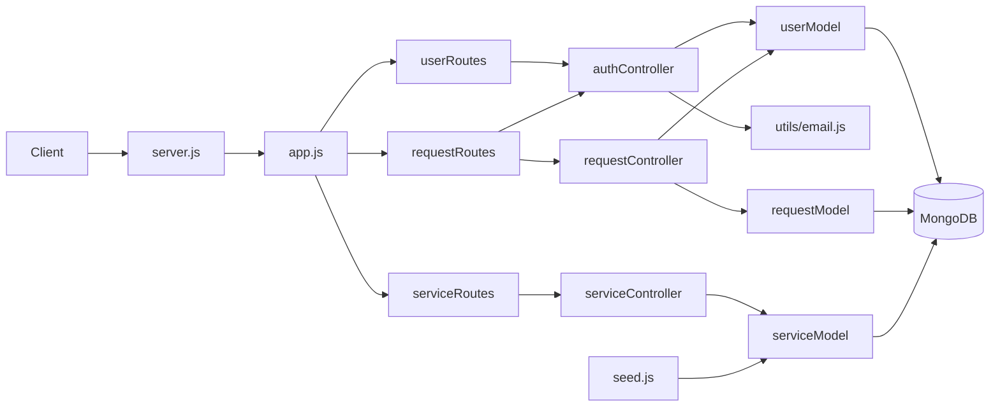

---

# 3. Technology Stack

## Packages Used in Source Code

| Technology | What It Is | Why Used | How Used in San3a |
|------------|-----------|----------|-------------------|
| **Node.js** | JS runtime | Server-side execution | `server.js`, `engines.node >= 16` |
| **Express** `^5.2.1` | Web framework | HTTP routing/middleware | `app.js`, route mounting at `/api/v1/*` |
| **MongoDB** | Document DB | Persistent storage | Connected in `server.js` |
| **Mongoose** `^9.6.3` | MongoDB ODM | Schemas, validation, queries | All models in `src/models/` |
| **dotenv** | Env loader | Secret/config management | `server.js`, `seed.js` |
| **jsonwebtoken** | JWT library | Stateless auth | `signToken()`, `jwt.verify()` in `authController.js` |
| **bcryptjs** | Password hashing | Secure storage | `userModel.js` pre-save (12 rounds), `correctPassword()` |
| **validator** | String validation | Email format | `validator.isEmail` on User.email |
| **crypto** (built-in) | Cryptography | Reset token generation/hashing | `createPasswordResetToken()`, `resetPassword()` |
| **cors** | CORS middleware | Frontend cross-origin | `app.js` with `FRONTEND_URL` |
| **nodemailer** `^6.10.1` | Email sending | Password reset emails | `src/utils/email.js` |
| **Geospatial Queries** | MongoDB feature | Nearby craftsman search | `$geoNear` aggregation in `requestController.js` |

## Packages in `package.json` But Not Used in Source

| Package | Status |
|---------|--------|
| **bcrypt** `^6.0.0` | Listed; **`bcryptjs` is used** in `userModel.js` |

## Technologies Not Implemented

| Technology | Status |
|------------|--------|
| **Joi** | Not implemented |
| **Multer** | Not implemented — no file uploads |
| **Cloudinary** | Not implemented — `avatar` is a string default |
| **Socket.IO** | Not implemented |
| **Helmet** | Not implemented |
| **Rate limiting** | Not implemented |
| **cookie-parser** | Not implemented — `protect` checks cookies but they are never parsed |

## Dev Dependencies

| Package | Purpose |
|---------|---------|
| **nodemon** | Auto-restart in development (`npm run dev`) |

## Docker

| File | Purpose |
|------|---------|
| `Dockerfile` | Multi-stage Node 20 Alpine image, non-root user, dumb-init |
| `docker-compose.yml` | MongoDB 7.0 + backend with health checks |
| `.dockerignore` | Excludes node_modules, .env, docs from image |

---

# 4. Database Documentation

Three Mongoose collections: **User**, **Service**, **Request**.

---

## 4.1 User Model

**File:** `src/models/userModel.js`  
**Collection:** `users`

### Purpose

Stores customers, craftsmen, and admins with authentication, geolocation, availability, rating, and response-time metrics.

### Fields

| Field | Type | Required | Default | Validation / Notes |
|-------|------|----------|---------|-------------------|
| `name` | String | Yes | — | Arabic error message |
| `email` | String | Yes | — | unique, lowercase, `validator.isEmail` |
| `phone` | String | Yes | — | unique |
| `password` | String | Yes | — | minlength 8, `select: false` |
| `role` | String | No | `'customer'` | enum: customer, craftsman, admin |
| `avatar` | String | No | `'default.png'` | No upload logic |
| `location.type` | String | No | `'Point'` | enum: ['Point'] |
| `location.coordinates` | [Number] | No | `[31.2357, 30.0444]` | [longitude, latitude] |
| `location.address` | String | No | — | Optional |
| `isAvailable` | Boolean | No | `true` | Craftsman availability for matching |
| `rating` | Number | No | `4.5` | min 1, max 5 — used in match scoring |
| `avgResponseTimeSeconds` | Number | No | `null` | Running average; null = insufficient data |
| `responseCount` | Number | No | `0` | Number of accept/reject responses recorded |
| `passwordChangedAt` | Date | No | — | JWT invalidation after password change |
| `isActive` | Boolean | No | `true` | `select: false`; checked in protect |
| `passwordResetToken` | String | No | — | SHA-256 hash of reset token |
| `passwordResetExpires` | Date | No | — | 10-minute expiry |
| `createdAt`, `updatedAt` | Date | Auto | — | timestamps |

### Indexes

```javascript
userSchema.index({ location: '2dsphere' });
```

### References

- Referenced by `Request.client`, `Request.craftsman`, `Request.matchingPool[].craftsman`

### Hooks

**`pre('save')`** — Hashes password with bcryptjs (12 rounds) when modified.

### Instance Methods

| Method | Purpose |
|--------|---------|
| `correctPassword(candidate, hash)` | bcrypt.compare |
| `changePasswordAfter(JWTTimestamp)` | Returns true if JWT issued before password change |
| `createPasswordResetToken()` | Generates plain token, stores SHA-256 hash, 10 min expiry |
| `recordResponseTime(responseSeconds)` | Updates running average of response time |

### Static Methods / Virtuals

**None.**

---

## 4.2 Service Model

**File:** `src/models/serviceModel.js`  
**Collection:** `services`

### Purpose

Catalog of home service types for the landing page and request creation.

### Fields

| Field | Type | Required | Default | Validation |
|-------|------|----------|---------|------------|
| `nameAr` | String | Yes | — | unique, trim |
| `nameEn` | String | Yes | — | unique, trim |
| `slug` | String | Yes | — | unique |
| `icon` | String | Yes | — | Icon identifier |
| `isActive` | Boolean | No | `true` | Filtered in getAllServices |
| `createdAt`, `updatedAt` | Date | Auto | — | timestamps |

### Indexes

Unique indexes on `nameAr`, `nameEn`, `slug` (via schema unique constraints).

### References

Referenced by `Request.service`.

### Hooks / Methods / Virtuals

**None.**

---

## 4.3 Request Model

**File:** `src/models/requestModel.js`  
**Collection:** `requests`

### Purpose

Customer service order from creation through completion, including craftsman matching pool tracking.

### Fields

| Field | Type | Required | Default | Validation |
|-------|------|----------|---------|------------|
| `client` | ObjectId → User | Yes | — | Customer |
| `craftsman` | ObjectId → User | No | `null` | Assigned on accept |
| `service` | ObjectId → Service | Yes | — | Service type |
| `status` | String | No | `PENDING_MATCHING` | enum: PENDING_MATCHING, ACCEPTED, ARRIVED, IN_PROGRESS, COMPLETED, CANCELLED |
| `statusHistory[]` | Subdocs | No | — | `{ status, changeAt, note }` |
| `matchingPool[]` | Subdocs | No | — | See below |
| `arriveAt` | Date | No | — | Not set by controllers |
| `startedAt` | Date | No | — | Not set by controllers |
| `completedAt` | Date | No | — | Not set by controllers |
| `location.address` | String | Yes | — | Text address |
| `location.coordinates` | [Number] | Yes | — | [longitude, latitude] |
| `scheduledAt` | Date | No | Date.now | Scheduling time |
| `clientNotes` | String | No | — | Customer notes |
| `pricing.baseFee` | Number | Yes | 0 | Set to 120 in controller |
| `pricing.emergencyFee` | Number | No | 0 | 30 for immediate requests |
| `pricing.totalAmount` | Number | Yes | 0 | Sum |
| `paymentMethod` | String | No | `CASH` | CASH, CARD, VODAFONE_CASH |
| `isPaid` | Boolean | No | `false` | No payment logic |
| `createdAt`, `updatedAt` | Date | Auto | — | timestamps |

### matchingPool Subdocument

| Field | Type | Default | Purpose |
|-------|------|---------|---------|
| `craftsman` | ObjectId → User | — | Craftsman who saw the offer |
| `offeredAt` | Date | Date.now | When offer was shown |
| `respondedAt` | Date | null | When craftsman responded |
| `response` | String | `PENDING` | PENDING, ACCEPTED, REJECTED, EXPIRED |

### Indexes

```javascript
requestSchema.index({ "location.coordinates": "2dsphere" });
```

Note: coordinates are not GeoJSON Point wrapper — index may not work for request-based geo queries. Matching uses User.location instead.

### Schema Inconsistency

Controllers push `changedAt` in statusHistory; schema field is `changeAt`.

### Hooks / Methods / Virtuals

**None.**

---

## Collection Relationships

```
User (customer)
 ├─ creates many → Request (as client)
 └─ may appear in many → Request.matchingPool

User (craftsman)
 ├─ has GeoJSON location (2dsphere index)
 ├─ has rating, avgResponseTimeSeconds, isAvailable
 ├─ assigned to many → Request (as craftsman)
 └─ tracked in → Request.matchingPool

Service
 └─ referenced by many → Request

Request
 ├─ belongs to one → User (client)
 ├─ optionally belongs to one → User (craftsman)
 ├─ belongs to one → Service
 └─ tracks many → matchingPool entries (craftsman offers/responses)
```

---

# 5. Authentication & Authorization Flow

## Signup

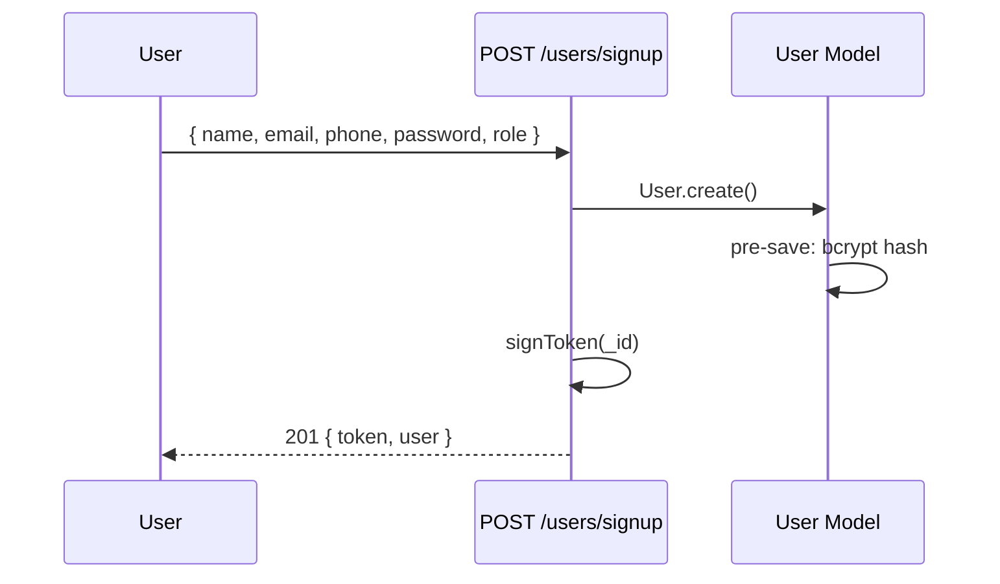

## Login

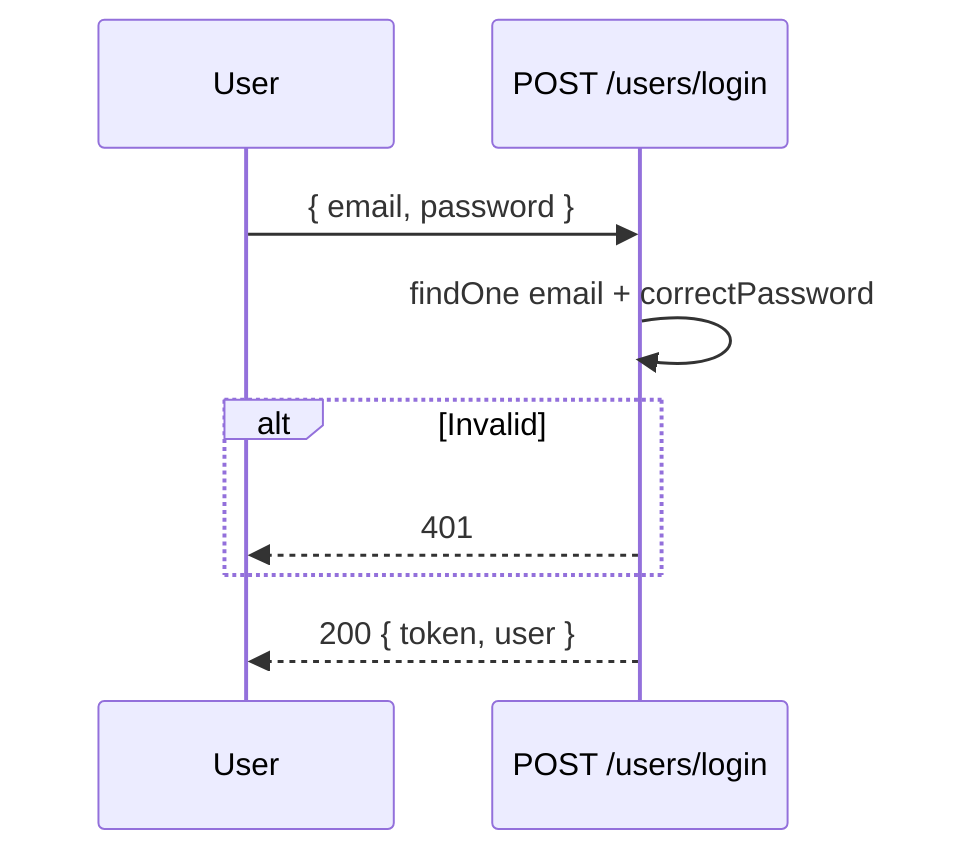

## Logout

**Not implemented.** Client removes token from storage.

## JWT Generation

```javascript
// authController.js
jwt.sign({ id }, process.env.JWT_SECRET, { expiresIn: '90d' });
```

## JWT Verification — `protect`

1. Extract token from `Authorization: Bearer` header OR `req.cookies.user_token`
2. `jwt.verify(token, JWT_SECRET)`
3. Load user with `select('+isActive')`
4. Reject if missing/inactive
5. Check `changePasswordAfter(decoded.iat)`
6. Set `req.user`, call `next()`

## `restrictTo(...roles)`

Checks `req.user.role` against allowed roles; returns 403 if not allowed. Must run after `protect`.

## Password Hashing

bcryptjs, 12 rounds (hardcoded). `BCRYPT_ROUNDS` in `.env.example` is **not used**.

## Token Expiration

90 days. **No refresh token strategy.**

## Security Considerations

| Aspect | Status |
|--------|--------|
| Password hashing | ✅ |
| JWT from env | ✅ |
| Role in JWT | ❌ Fetched from DB each request |
| Admin signup restriction | ❌ |
| Cookie auth | ⚠️ Referenced but cookie-parser not installed |
| Token logged to console | ⚠️ In protect middleware |

---

# 6. Password Reset Flow

## Forgot Password — `POST /api/v1/users/forgotPassword`

1. Find user by email → 404 if missing
2. `createPasswordResetToken()` — plain token returned, SHA-256 hash stored, 10 min expiry
3. Save user with `validateBeforeSave: false`
4. Build reset URL: `{protocol}://{host}/api/v1/users/resetPassword/{plainToken}`
5. Send email via Nodemailer
6. On email failure: clear reset fields, return 500

### Why Crypto

- `randomBytes(32)` — unpredictable token
- SHA-256 hash in DB — DB leak does not expose usable tokens

## Reset Password — `POST /api/v1/users/resetPassword/:token`

1. Hash `req.params.token` with SHA-256
2. Find user where hash matches and not expired
3. Set `user.password = req.body.password`
4. Clear reset token fields
5. `user.save()`

### Incomplete Implementation

- Does **not** set `passwordChangedAt`
- Does **not** return JWT or HTTP response on success (handler ends without `res.json`)
- References `passwordConfrim` (typo) — field not in schema

---

# 7. API Documentation

**Base URL:** `http://localhost:5000/api/v1`

---

## GET `/`

| Property | Value |
|----------|-------|
| Purpose | Health check |
| Auth | No |
| Response | Plain text: `server is working ....` |

---

## POST `/api/v1/users/signup`

| Property | Value |
|----------|-------|
| Purpose | Register new user |
| Auth | No |
| Roles | Any (role in body) |

**Body:** `{ name, email, phone, password, role? }`

**Success:** `201` — `{ status, token, data: { user } }`

**Errors:** `400` validation/duplicate

**Flow:** User.create → hash password → signToken → return

---

## POST `/api/v1/users/login`

| Property | Value |
|----------|-------|
| Purpose | Authenticate |
| Auth | No |

**Body:** `{ email, password }`

**Success:** `200` — `{ status, token, data: { user } }`

**Errors:** `400` missing fields, `401` invalid credentials, `500` server error

---

## POST `/api/v1/users/forgotPassword`

| Property | Value |
|----------|-------|
| Purpose | Send reset email |
| Auth | No |

**Body:** `{ email }`

**Success:** `200` — `{ status: 'success', message: 'تم إرسال الإيميل' }`

**Errors:** `404` user not found, `500` email failure

---

## POST `/api/v1/users/resetPassword/:token`

| Property | Value |
|----------|-------|
| Purpose | Reset password |
| Auth | No (token in URL) |

**Params:** `token` — plain reset token

**Body:** `{ password, passwordConfrim? }`

**Errors:** `400` invalid/expired token

**⚠️ Incomplete:** No success response returned.

---

## GET `/api/v1/users/profile`

| Property | Value |
|----------|-------|
| Purpose | Protected profile test route |
| Auth | Yes |

**Headers:** `Authorization: Bearer <token>`

**Success:** `200` — user data in response

---

## GET `/api/v1/users/admin-dashboard`

| Property | Value |
|----------|-------|
| Auth | Yes |
| Roles | `admin` |

**Success:** `200` placeholder message

**Errors:** `403`

---

## GET `/api/v1/users/craftsman-orders`

| Property | Value |
|----------|-------|
| Auth | Yes |
| Roles | `craftsman`, `admin` |

**Success:** `200` placeholder — no order listing logic

---

## GET `/api/v1/services/`

| Property | Value |
|----------|-------|
| Purpose | List active services |
| Auth | No |

**Success:** `200` — `{ status, results, data: { services } }`

---

## POST `/api/v1/services/`

| Property | Value |
|----------|-------|
| Purpose | Create service |
| Auth | No |

**Body:** `{ nameAr, nameEn, slug, icon, isActive? }`

**Success:** `201`

**Errors:** `400` duplicate/validation

**⚠️ No auth restriction.**

---

## POST `/api/v1/requests/`

| Property | Value |
|----------|-------|
| Purpose | Create service request |
| Auth | Yes |

**Body:**

| Field | Type | Required |
|-------|------|----------|
| service | ObjectId | Yes |
| address | string | Yes |
| coordinates | [lng, lat] | Yes |
| clientNotes | string | No |
| paymentMethod | string | No |
| scheduledAt | date | No |

**Success:** `201` — request with pricing

**Pricing:** baseFee=120, emergencyFee=30 if immediate

---

## GET `/api/v1/requests/:id`

| Property | Value |
|----------|-------|
| Purpose | Get request by ID |
| Auth | Yes |

**⚠️ No ownership check** — any authenticated user can read any request.

---

## GET `/api/v1/requests/:requestId/nearby-craftsmen`

| Property | Value |
|----------|-------|
| Purpose | Find nearby available craftsmen |
| Auth | Yes |

**Query:** `radius` (meters, default **5000**)

**Success:** `200` — `{ craftsmen: [{ name, phone, avatar, rating, distance }] }`

**Internal Flow:**
1. Load request, extract coordinates
2. `$geoNear` aggregation on User (role=craftsman, isAvailable=true)
3. Add new craftsmen to `matchingPool`
4. Return sorted by distance

---

## GET `/api/v1/requests/:requestId/match-results`

| Property | Value |
|----------|-------|
| Purpose | Ranked craftsmen with match percentage |
| Auth | Yes |

**Query:** `radius` (meters, default **10000**)

**Success:** `200` — `{ matches: [{ matchPercentage, breakdown, distanceKm, ... }] }`

**Match Weights:**

| Factor | Weight |
|--------|--------|
| Distance | 40% |
| Rating | 30% |
| Response time | 20% |
| Prior history with client | 10% |

**Internal Flow:**
1. `$geoNear` find craftsmen within radius
2. Aggregate completed request count per craftsman for this client
3. Normalize each factor 0–1, compute weighted score
4. Sort by `matchPercentage` descending

---

## POST `/api/v1/requests/:requestId/accept`

| Property | Value |
|----------|-------|
| Purpose | Craftsman accepts request |
| Auth | Yes |
| Roles | `craftsman` (enforced in controller) |

**Success:** `200` — request with status ACCEPTED

**DB Updates:**
- `craftsman = req.user._id`, `status = ACCEPTED`
- Update matchingPool entry (ACCEPTED, respondedAt)
- `isAvailable = false` on craftsman
- `recordResponseTime()` if pool entry existed

**Errors:** `403` wrong role, `404` not found, `400` not PENDING_MATCHING

---

## POST `/api/v1/requests/:requestId/reject`

| Property | Value |
|----------|-------|
| Purpose | Craftsman rejects offered request |
| Auth | Yes |
| Roles | `craftsman` |

**Success:** `200` — confirmation message

**DB Updates:** matchingPool REJECTED + response time recorded

**Errors:** `400` if request was not offered to this craftsman

---

## PATCH `/api/v1/requests/:requestId/status`

| Property | Value |
|----------|-------|
| Purpose | Update request status |
| Auth | Yes |
| Roles | Assigned craftsman only |

**Body:** `{ status }`

**Errors:** `403` not assigned craftsman, `404` not found

---

## PATCH `/api/v1/requests/:requestId/complete`

| Property | Value |
|----------|-------|
| Purpose | Mark request COMPLETED |
| Auth | Yes |
| Roles | Assigned craftsman |

**DB Updates:** status=COMPLETED, craftsman isAvailable=true

---

## 404 Handler

Any unmatched route → `{ status: 'fail', message: "can't find {url} on this server !" }`

---

# 8. Request Lifecycle

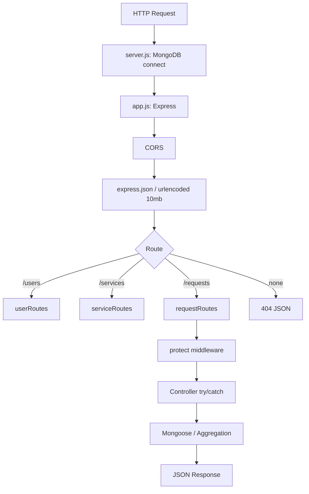

**Not present:** validation middleware layer, service layer, global error handler, async wrapper.

---

# 9. Business Flows

## Customer Registration

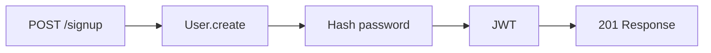

## Customer Creates Request

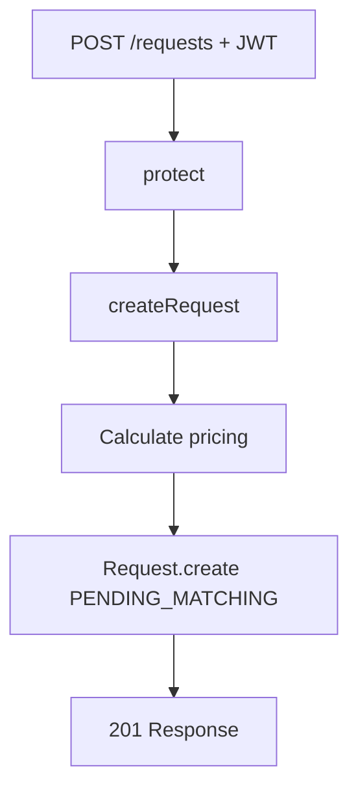

## Craftsman Discovery (Nearby)

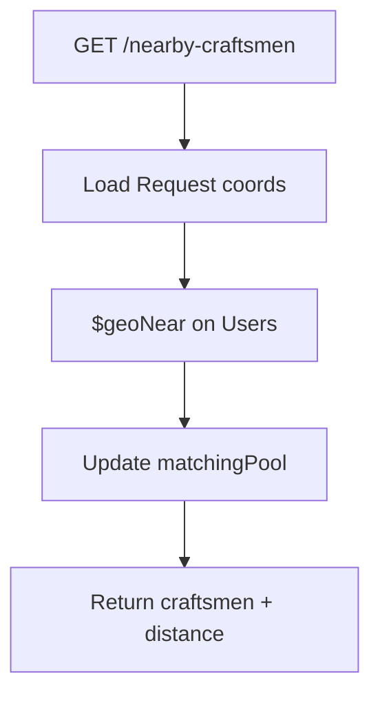

## Weighted Match Scoring

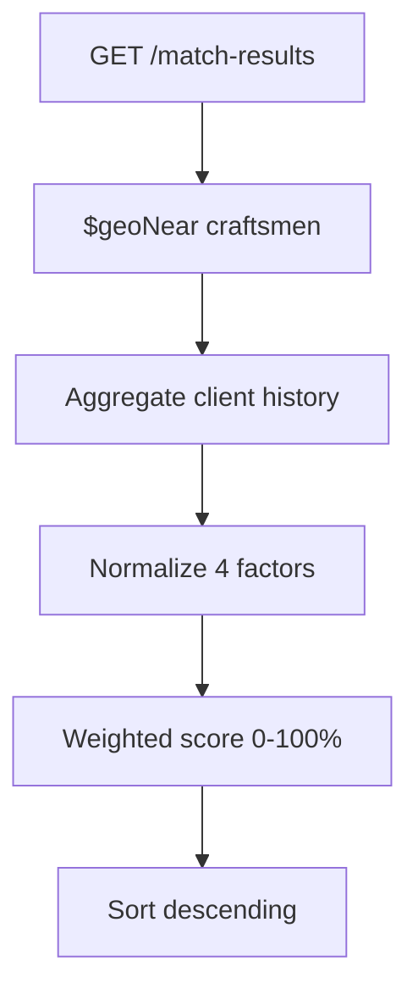

## Craftsman Accepts Request

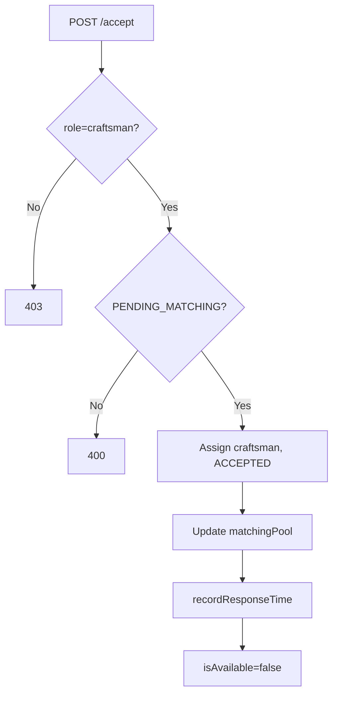

## Craftsman Rejects Request

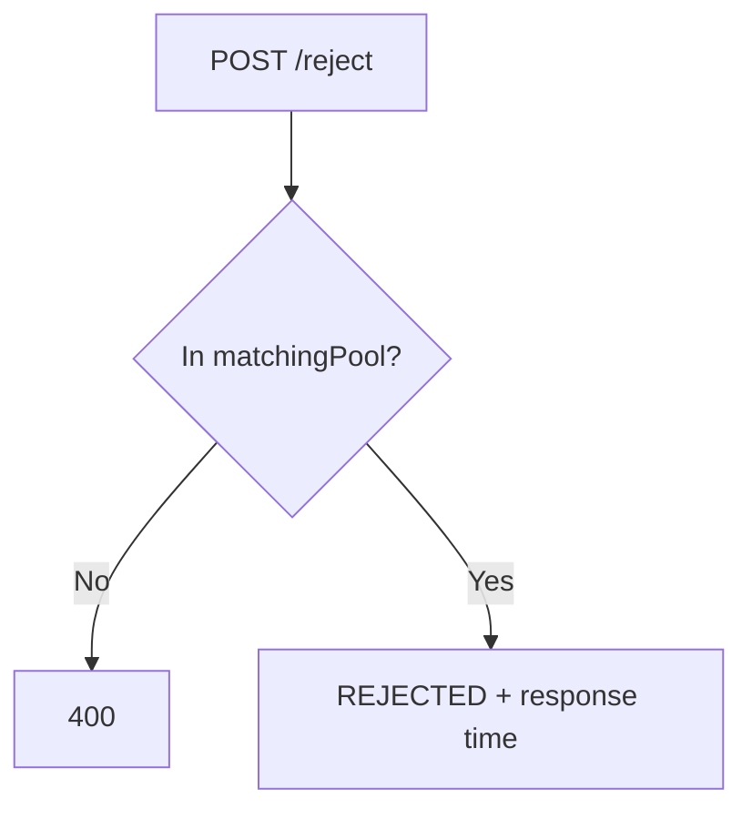

## Request Status Update / Completion

Craftsman-only; ownership verified. Complete sets `isAvailable=true`.

## Review and Rating Flow

**Not implemented.** `User.rating` exists (default 4.5) and is used in match scoring, but **no API submits or recalculates ratings**.

## Notification Flow

**Not implemented.**

## Payment Flow

**Partially implemented (data only):** `paymentMethod` and `isPaid` stored; no gateway or mark-paid endpoint.

---

# 10. Geolocation Logic

## Coordinate Storage

**User (craftsman)** — GeoJSON Point:
```javascript
location: {
  type: 'Point',
  coordinates: [longitude, latitude],  // default Cairo area
  address: String
}
```

**Request** — plain array:
```javascript
location: {
  address: String,
  coordinates: [longitude, latitude]
}
```

## 2dsphere Indexes

| Collection | Index |
|------------|-------|
| users | `{ location: '2dsphere' }` |
| requests | `{ "location.coordinates": "2dsphere" }` (may be invalid — not GeoJSON) |

## Geospatial Queries (Actual Code)

Both `findNearbyCraftsmen` and `getMatchResults` use **aggregation pipeline with `$geoNear`**:

```javascript
User.aggregate([
  {
    $geoNear: {
      near: { type: 'Point', coordinates: [longitude, latitude] },
      distanceField: 'distance',
      maxDistance: radiusInMeters,
      query: { role: 'craftsman', isAvailable: true },
      spherical: true,
    },
  },
  // ... $project, $sort
]);
```

## Distance

- Returned as `distance` in meters from `$geoNear`
- `getMatchResults` also exposes `distanceKm` (rounded to 1 decimal)
- Default search radii: **5 km** (nearby), **10 km** (match results)

## Nearby Matching Process

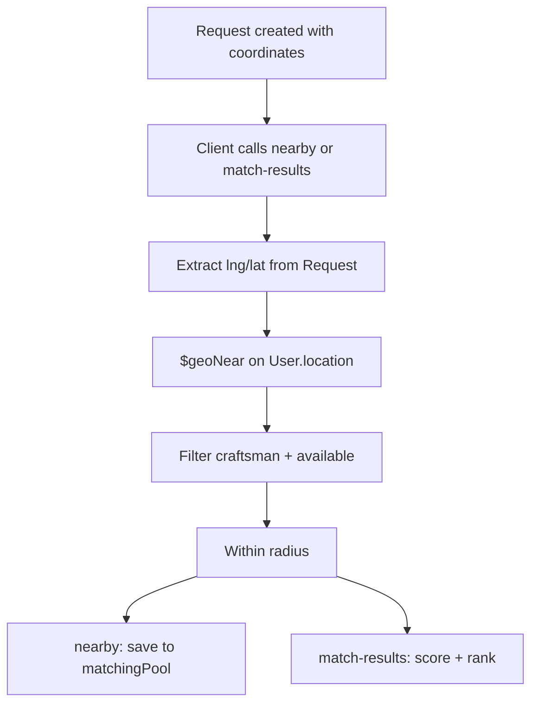

Craftsmen must have accurate `User.location` coordinates. Default is Cairo `[31.2357, 30.0444]`.

---

# 11. Middleware Documentation

## Global (app.js)

| Middleware | Purpose | Security |
|------------|---------|----------|
| cors | Allow FRONTEND_URL origin | Restricts cross-origin |
| express.json | Parse JSON, 10mb limit | Payload size limit |
| express.urlencoded | Parse forms, 10mb | Same |
| 404 handler | Unknown routes | Returns fail JSON |

## protect (authController.js)

| Property | Value |
|----------|-------|
| Input | Bearer header or cookie |
| Output | `req.user`, `next()` |
| Errors | 401 JSON |
| Order | Applied via `router.use()` on request routes; per-route on user routes |

## restrictTo (authController.js)

| Property | Value |
|----------|-------|
| Input | `req.user.role` |
| Errors | 403 |
| Order | After protect |

## Not Implemented

Global error handler, catchAsync, validators, upload middleware, rate limiting, Helmet, cookie-parser.

---

# 12. Utility Functions

## sendEmail(options) — `src/utils/email.js`

| Property | Value |
|----------|-------|
| Purpose | Send plain-text email via SMTP |
| Used by | forgotPassword |
| Input | `{ email, subject, message }` |
| Env | EMAIL_HOST, EMAIL_PORT, EMAIL_USERNAME, EMAIL_PASSWORD |

## signToken(id) — `authController.js`

Generates 90-day JWT with user id.

## normalize(value, min, max, lowerIsBetter) — `requestController.js`

Normalizes a value to 0–1 range for match scoring. Inverts when lower is better (distance, response time).

## User.recordResponseTime(seconds) — `userModel.js`

Running average update for craftsman response metrics.

---

# 13. Error Handling Strategy

- **Local try/catch** in every controller
- **No global error handler**
- **No AppError class**
- **No catchAsync wrapper**
- `NODE_ENV` not used for error formatting
- Inconsistent response shapes (some errors omit `status` field)

**Success format:** `{ status: 'success', data: {...} }`  
**Failure format:** `{ status: 'fail', message, error? }`

---

# 14. Security Documentation

## Implemented

Password hashing, JWT auth, env-based secrets, hashed reset tokens, email validation, password select:false, CORS restriction, Mongoose parameterized queries, inactive user check, Docker non-root user.

## Missing / Gaps

Helmet, rate limiting, admin signup restriction, unprotected service POST, IDOR on GET request, JWT console logging, incomplete reset password, no HTTPS enforcement, 90-day JWT expiry, cookie-parser for cookie auth.

---

# 15. Environment Variables

| Variable | Purpose | Example | Mandatory |
|----------|---------|---------|-----------|
| MONGO_URI | MongoDB connection | mongodb://localhost:27017/san3a | Yes |
| JWT_SECRET | JWT signing | long random string | Yes |
| PORT | Server port | 5000 | No |
| NODE_ENV | Environment | development | No |
| FRONTEND_URL | CORS origin | http://localhost:3000 | No |
| EMAIL_HOST | SMTP host | smtp.mailtrap.io | For password reset |
| EMAIL_PORT | SMTP port | 587 | For password reset |
| EMAIL_USERNAME | SMTP user | — | For password reset |
| EMAIL_PASSWORD | SMTP pass | — | For password reset |
| BCRYPT_ROUNDS | Documented only | 10 | No (unused in code) |

## Example `.env.example`

```env
MONGO_URI=mongodb://localhost:27017/san3a
PORT=5000
NODE_ENV=development
FRONTEND_URL=http://localhost:3000
JWT_SECRET=your_jwt_secret_key_here
BCRYPT_ROUNDS=10

EMAIL_HOST=smtp.mailtrap.io
EMAIL_PORT=587
EMAIL_USERNAME=your_smtp_username
EMAIL_PASSWORD=your_smtp_password
```

---

# 16. Deployment Documentation

## Local Installation

```bash
cd backend
npm install
cp .env.example .env
# Edit .env
npm run dev
```

## npm Scripts

| Script | Command |
|--------|---------|
| start | node server.js |
| dev | nodemon server.js |
| start:prod | NODE_ENV=production node server.js |
| test | Not implemented (placeholder) |

## Seed Data

```bash
node seed.js
```

Seeds 4 services (cleaning, ac, plumbing, electricity) via upsert on slug.

## Docker

```bash
# From backend directory — set MONGO_URI, JWT_SECRET, etc. in .env
docker compose up --build
```

- MongoDB: port 27017, volume `mongo-data`
- Backend: port 5000, waits for mongo health check
- Production image: Node 20 Alpine, dumb-init, non-root `appuser`

## Database Setup

MongoDB creates database/collections on first write. For Docker local dev, use `mongodb://mongo:27017/san3a` as noted in docker-compose comments.

---

# 17. API Flow Diagrams

## Authentication

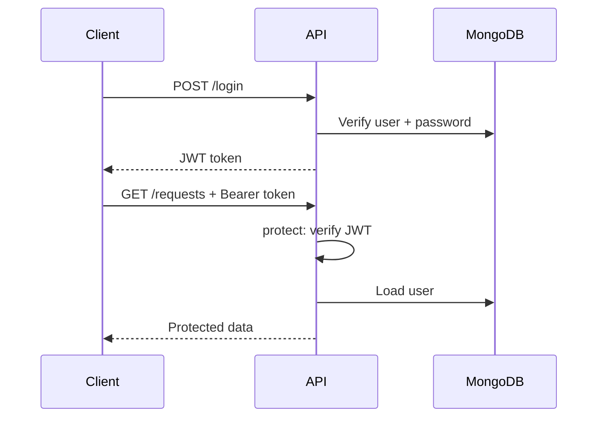

## Password Reset

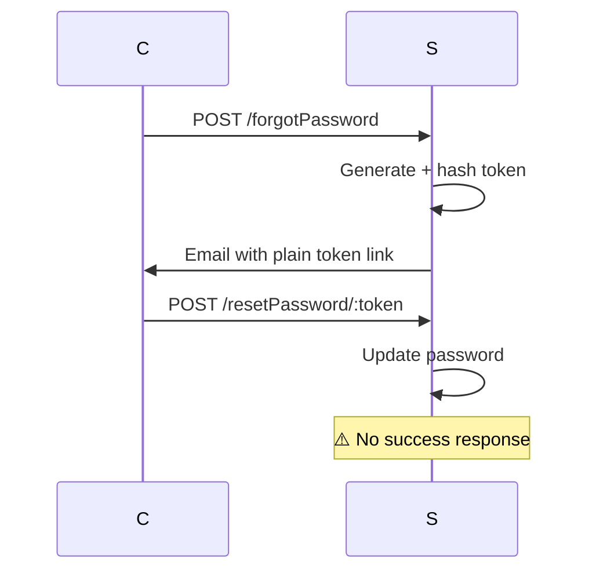

## Customer Request + Matching

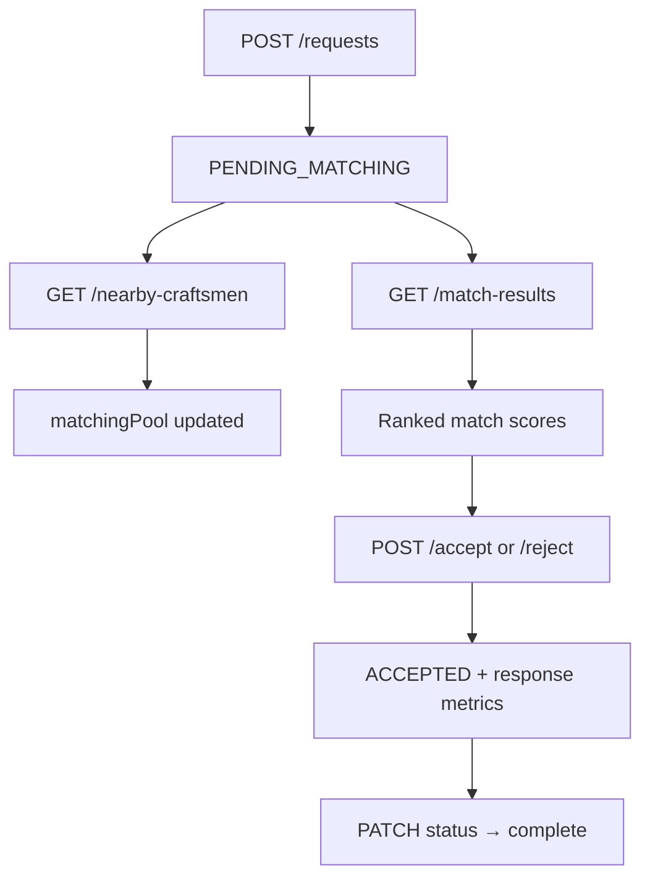

## Request Completion

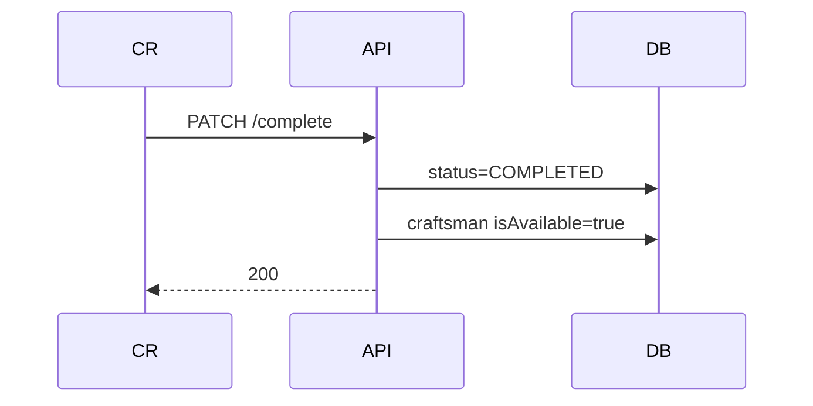

---

# 18. Project Assessment

## Strengths

1. **Smart matching algorithm** with weighted multi-factor scoring
2. **matchingPool + response time tracking** for data-driven improvements
3. **$geoNear aggregation** with configurable radius and distance in response
4. **Accept/reject flows** properly wired with routes
5. **Docker production setup** with multi-stage build, health checks, non-root user
6. **Seed script** for reproducible service catalog
7. **nodemailer** properly declared in dependencies
8. Solid JWT + bcrypt auth foundation

## Weaknesses

1. **resetPassword incomplete** — no response, no passwordChangedAt
2. **No review API** despite rating field in model
3. **No global error handler** or service layer
4. **Schema inconsistencies** — changeAt vs changedAt
5. **bcrypt package unused** (bcryptjs used instead)
6. **No automated tests**

## Scalability

Single Node process; no caching; match scoring runs per request; consider compound geo index `{ role: 1, isAvailable: 1, location: '2dsphere' }`.

## Security

Priority fixes: complete reset flow, remove JWT logging, protect service POST, add request ownership checks, rate limit auth endpoints.

## Production Readiness

| Item | Status |
|------|--------|
| Docker | ✅ |
| Seed script | ✅ |
| Health check (Docker) | ✅ wget on `/` |
| JSON health endpoint | ❌ |
| Tests | ❌ |
| CI/CD | ❌ |
| Monitoring | ❌ |

## Suggested Improvements

1. Extract middleware to `src/middleware/`
2. Add `PATCH /requests/:id/cancel` for customers
3. Review model + POST rating after completion
4. Complete resetPassword with JWT response
5. Use `process.env.BCRYPT_ROUNDS` or remove from .env.example
6. Add npm script: `"seed": "node seed.js"`

---

*End of San3a Backend Technical Documentation*
